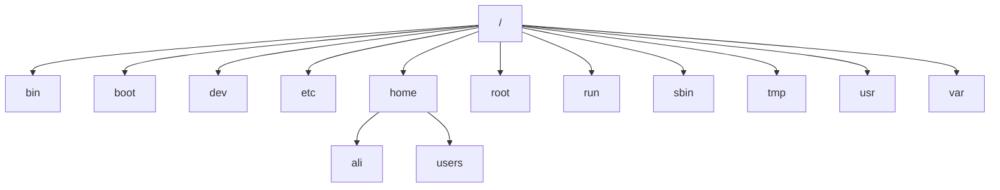

# Manage Files from the Command Line


## Describe Linux File System Hierarchy Concepts

The File-system Hierarchy chart:



### Describe Linux File System Hierarchy

File System Hierarchy Standard

Dosyalarin ve dizinlerin nasil organize edildigi. Hangi dizinin altında neler saklandigi ve saklanabilecegi bu standartda belirlenir.(Unix ve Linux'da aynidir)


asagidaki ciktida l ile baslyanlar soft link d ile baslayan dizin(directory'dir)
```sh
[root@rocky2 /]# ll
total 28
dr-xr-xr-x.   2 root root    6 May 16  2022 afs
lrwxrwxrwx.   1 root root    7 May 16  2022 bin -> usr/bin
dr-xr-xr-x.   5 root root 4096 Mar  2 15:07 boot
drwxr-xr-x.  20 root root 3320 Mar  8 19:19 dev
drwxr-xr-x.  80 root root 8192 Mar  8 19:25 etc
drwxr-xr-x.  20 root root 4096 Mar  3 03:49 home
lrwxrwxrwx.   1 root root    7 May 16  2022 lib -> usr/lib
lrwxrwxrwx.   1 root root    9 May 16  2022 lib64 -> usr/lib64
drwxr-xr-x.   2 root root    6 May 16  2022 media
drwxr-xr-x.   2 root root    6 May 16  2022 mnt
drwxr-xr-x.   2 root root    6 May 16  2022 opt
dr-xr-xr-x. 208 root root    0 Mar  8 19:18 proc
dr-xr-x---.   4 root root  183 Mar  6 21:27 root
drwxr-xr-x.  27 root root  800 Mar  8 19:19 run
lrwxrwxrwx.   1 root root    8 May 16  2022 sbin -> usr/sbin
drwxr-xr-x.   2 root root    6 May 16  2022 srv
dr-xr-xr-x.  13 root root    0 Mar  8 19:19 sys
drwxrwxrwt.   6 root root 4096 Mar  8 19:34 tmp
drwxr-xr-x.  12 root root  144 Feb 25 20:05 usr
drwxr-xr-x.  20 root root 4096 Feb 28 05:11 var
```

### Significant Red Hat Enterprise Linux Directories

#### root

Root kullanıcısınn home dizinidir.

#### Home

Oluşturulan kullanicilarin default home dizinidir.

#### bin / sbin

User-Kullanici seviyesinde saklanan komutlar Bin klasörü altında saklanir. Regular user'lar calistirabilir

Sbin dizininde yetkili user'lar calistirabilir. Bu betikler  C dilinde yazilmistir.

Bu dizinler ilgili betik silinirse komut calismaz. Farkli bir sunucudan ayni betik dizine kopyalanirsa betik celisabilir duruma gelir

```sh
[root@rocky2 sbin]# mv useradd useradd.bak
[root@rocky2 sbin]# useradd
bash: useradd: command not found
[root@rocky2 sbin]#
[root@rocky2 sbin]# mv useradd.bak useradd
[root@rocky2 sbin]# useradd
Usage: useradd [options] LOGIN
       useradd -D
       useradd -D [options]

Options:
      --badname                 do not check for bad names
  -b, --base-dir BASE_DIR       base directory for the home directory of the
                                new account
      --btrfs-subvolume-home    use BTRFS subvolume for home directory
```


Uc tip user seviyesi bulunamaktadır.

Regular user

System user

Root user


#### etc


Os servislerinin ve sonradan kurulan servislerin sistem yapılandirma dosyalaridir.  Yapilandirmayi ne varsa /etc altinda yer alir.

DNS, SSH, IP, WEB, FW, etc.


#### var

Desisken data'ların tutulduğu dizindir. Dinamiz degiskenlerin hepsi burada saklanir . 

Log'lar Cache , mail log'ları, print spooler, Rsyslog

```sh
[root@rocky2 log]# ll /var/log
total 1912
drwxr-xr-x. 2 root   root     4096 Feb 25 20:09 anaconda
drwx------. 2 root   root       23 Feb 25 20:09 audit
-rw-------. 1 root   root       61 Mar  2 23:52 boot.log
-rw-rw----. 1 root   utmp     4224 Mar  6 21:28 btmp
-rw-rw----. 1 root   utmp        0 Feb 25 20:05 btmp-20240302
drwxr-x---. 2 chrony chrony      6 Apr 17  2023 chrony
```

#### tmp

Geçici dosyaların bulundugu. Her yeniden baslatmada silinir. Saatlik sinirlamada yapılabilmektedir 8 saat 24 saat


/var/tmp bu dizinde saklanan veriler 30 gun boyunca saklanır.  Gunu ayarlanabilmektedir. 30 gun sonunda silinir. Reboot ile silinmez


#### boot

EFI ve boot burada yer alir. İsletim sisteminin acilmasi icindir


#### dev

Donanım bilgileri yer alır. Speacial device

Soket bilgileri, tty (interactive connection-terminal- Tele type)

#### lib

Kendi yazdığınız veya 3 party bir uygulamanın verileri saklanabilir. Kutuphanelerin saklandığı dizindir. 
lib dizini soft linktir. /usr/lib altında yer alır

```sh
[root@rocky2 /]# ll
total 28
dr-xr-xr-x.   2 root root    6 May 16  2022 afs
drwxr-xr-x.   2 root root    6 Mar  6 20:17 backuptest
lrwxrwxrwx.   1 root root    7 May 16  2022 bin -> usr/bin
dr-xr-xr-x.   5 root root 4096 Mar  2 15:07 boot
drwxr-xr-x.  20 root root 3320 Mar  8 19:19 dev
drwxr-xr-x.  80 root root 8192 Mar  8 19:25 etc
drwxr-xr-x.  20 root root 4096 Mar  3 03:49 home
lrwxrwxrwx.   1 root root    7 May 16  2022 lib -> usr/lib
lrwxrwxrwx.   1 root root    9 May 16  2022 lib64 -> usr/lib64
```

#### opt


Optinial özel uygulamalar, özel betikler, bağımsız kurulumlar yapmak için.


## Specify Files by Name


### Absolute Paths and Relative Paths

Mutlak-kesin path ve göreceli path

Absolute Path-->kökten dizinden başlayarak ilgili dosyaya tam yolu belirtilen path. Her zaman kesin sonuca ulaştırır

```sh
[root@rocky2 /]# cd /root/serverbackup/
[root@rocky2 serverbackup]#
```

Relative path--> varolan dizine göre ve belirtilen 

```sh
~/test/ornek
```

Üç farklı yöntem bulunur.

~/test/ornek


~  kullanıcının masaüstünü temsil eder

Ec2-user

Bir üst dizine geçmek için
../home


### Navigate Paths in the File System

Hangi dizinde çalıştığımızı gösterir

#### pwd 

Change directory

#### cd

Bir klasörü gitmeden önceki dizine 

Cd -

Bir üst dizine gidebilmek için
Cd ..


```sh
[root@rocky2 /]# cd /tmp
[root@rocky2 tmp]# pwd
/tmp
[root@rocky2 tmp]# cd -
/
[root@rocky2 /]# cd ..
[root@rocky2 /]#
```

#### ls


The ls command has multiple options for displaying attributes on files. The most common options
are 
-l (long listing format), 
-a (all files, including hidden files), and gizli dosyalari da goruntuler
-R (recursive, to include  the contents of all subdirectories). alt klasorleri de icerir


```sh
[root@rocky2 /]# ls
afs  backuptest  bin  boot  dev  etc  home  lib  lib64  media  mnt  opt  proc  root  run  sbin  srv  sys  test  tmp  usr  var
[root@rocky2 /]# ls -l /etc/ssh
total 600
-rw-r--r--. 1 root root     578094 Mar  6 13:00 moduli
-rw-r--r--. 1 root root       1921 Mar  6 13:00 ssh_config
drwxr-xr-x. 2 root root         28 Mar  6 13:01 ssh_config.d
-rw-------. 1 root root       3667 Mar  6 13:00 sshd_config
drwx------. 2 root root         59 Mar  6 13:01 sshd_config.d
-rw-r-----. 1 root ssh_keys    480 Feb 25 20:09 ssh_host_ecdsa_key
-rw-r--r--. 1 root root        162 Feb 25 20:09 ssh_host_ecdsa_key.pub
-rw-r-----. 1 root ssh_keys    387 Feb 25 20:09 ssh_host_ed25519_key
-rw-r--r--. 1 root root         82 Feb 25 20:09 ssh_host_ed25519_key.pub
-rw-r-----. 1 root ssh_keys   2578 Feb 25 20:10 ssh_host_rsa_key
-rw-r--r--. 1 root root        554 Feb 25 20:10 ssh_host_rsa_key.pub
[root@rocky2 /]# ls -la ~
total 40
dr-xr-x---.  4 root root  183 Mar  6 21:27 .
dr-xr-xr-x. 20 root root  265 Mar  8 22:55 ..
-rw-------.  1 root root 1425 Feb 25 20:09 anaconda-ks.cfg
-rw-------.  1 root root 8229 Mar  8 22:16 .bash_history
-rw-r--r--.  1 root root   18 May 11  2022 .bash_logout
-rw-r--r--.  1 root root  141 May 11  2022 .bash_profile
-rw-r--r--.  1 root root  429 May 11  2022 .bashrc
-rw-r--r--.  1 root root  100 May 11  2022 .cshrc
-rw-------.  1 root root   20 Mar  3 08:38 .lesshst
drwxr-xr-x.  2 root root    6 Mar  6 21:27 serverbackup
drwx------.  2 root root   80 Mar  2 15:10 .ssh
-rw-r--r--.  1 root root  129 May 11  2022 .tcshrc
```

Hiyeraşik olarak listeler

```sh
[root@rocky2 ~]# ls -lR
.:
total 4
-rw-------. 1 root root 1425 Feb 25 20:09 anaconda-ks.cfg
drwxr-xr-x. 2 root root    6 Mar  6 21:27 serverbackup

./serverbackup:
total 0
```

#### mkdir

Klasör-dizin oluşturmak için

mkdir -p 

Parent directory

Önce üst klasör oluşturulur

```sh
[root@rocky2 ~]# mkdir -p parentfolder/child1 parentfolder/child2
[root@rocky2 ~]# ls -lR
.:
total 8
-rw-------. 1 root root 1425 Feb 25 20:09 anaconda-ks.cfg
-rw-r--r--. 1 root root   60 Mar  8 23:07 output.txt
drwxr-xr-x. 4 root root   34 Mar  8 23:07 parentfolder
drwxr-xr-x. 2 root root    6 Mar  6 21:27 serverbackup

./parentfolder:
total 0
drwxr-xr-x. 2 root root 6 Mar  8 23:07 child1
drwxr-xr-x. 2 root root 6 Mar  8 23:07 child2

./parentfolder/child1:
total 0

./parentfolder/child2:
total 0

./serverbackup:
total 0
[root@rocky2 ~]#
```

multiple folder oluşturma

```sh
[root@rocky2 Documents]# mkdir ProjectX ProjectY ProjectZ
[root@rocky2 Documents]# ls -la
total 4
drwxr-xr-x. 5 root root   54 Mar  9 00:12 .
dr-xr-x---. 9 root root 4096 Mar  8 23:17 ..
drwxr-xr-x. 2 root root    6 Mar  9 00:12 ProjectX
drwxr-xr-x. 2 root root    6 Mar  9 00:12 ProjectY
drwxr-xr-x. 2 root root    6 Mar  9 00:12 ProjectZ
[root@rocky2 Documents]#  mkdir -p Thesis/Chapter1 Thesis/Chapter2 Thesis/Chapter3
[root@rocky2 Documents]# ls -R Thesis/
Thesis/:
Chapter1  Chapter2  Chapter3

Thesis/Chapter1:

Thesis/Chapter2:

Thesis/Chapter3:
```


#### cp

Aynı anda 1'den 10'a kadar dosya oluşturma. Farklı opsiyonlarla çoklu işlemler yapılabilir.


```sh
[root@rocky2 files]# touch dosya_{1..10}.txt
[root@rocky2 files]# ls -l
total 0
-rw-r--r--. 1 root root 0 Mar  8 23:12 dosya_10.txt
-rw-r--r--. 1 root root 0 Mar  8 23:12 dosya_1.txt
-rw-r--r--. 1 root root 0 Mar  8 23:12 dosya_2.txt
-rw-r--r--. 1 root root 0 Mar  8 23:12 dosya_3.txt
-rw-r--r--. 1 root root 0 Mar  8 23:12 dosya_4.txt
-rw-r--r--. 1 root root 0 Mar  8 23:12 dosya_5.txt
-rw-r--r--. 1 root root 0 Mar  8 23:12 dosya_6.txt
-rw-r--r--. 1 root root 0 Mar  8 23:12 dosya_7.txt
-rw-r--r--. 1 root root 0 Mar  8 23:12 dosya_8.txt
-rw-r--r--. 1 root root 0 Mar  8 23:12 dosya_9.txt
```

```sh
[root@rocky2 ~]# touch Videos/blockbuster1.ogg
[root@rocky2 ~]# touch Videos/blockbuster2.ogg
[root@rocky2 ~]# touch Documents/thesis_chapter1.odf
[root@rocky2 ~]# touch Documents/thesis_chapter2.odf
```

```sh
[root@rocky2 ~]# touch dosya{1..5}.txt
[root@rocky2 ~]#  cp dosya1.txt Documents/
[root@rocky2 ~]# cd Documents
[root@rocky2 Documents]# ls -l
total 0
-rw-r--r--. 1 root root 0 Mar  8 23:17 dosya1.txt
-rw-r--r--. 1 root root 0 Mar  8 23:15 thesis_chapter1.odf
-rw-r--r--. 1 root root 0 Mar  8 23:16 thesis_chapter2.odf
[root@rocky2 Documents]#
[root@rocky2 Documents]# cp /tmp/kopya1.txt /home/ali/Documents/parentfolder/
[root@rocky2 Documents]#  cp /tmp/kopya1.txt ~/Documents/parentfolder/
```

#### mv 

Hem taşıma hem de rename için kullanılır.


```sh
[root@rocky2 Documents]#  mv /tmp/kopya1.txt ~/Documents/parentfolder

[root@rocky2 tmp]# cd /tmp/
[root@rocky2 tmp]#  mkdir tasima-kopyalama
[root@rocky2 ~]# cd ~/Documents/
[root@rocky2 Documents]# ls
dosya1.txt  parentfolder  thesis_chapter1.odf  thesis_chapter2.odf
[root@rocky2 Documents]# pwd
/root/Documents

[root@rocky2 Documents]#  mv -v /tmp/tasima-kopyalama ~/Documents/tasima-kopyalama
renamed '/tmp/tasima-kopyalama' -> '/root/Documents/tasima-kopyalama'
[root@rocky2 Documents]#
[root@rocky2 Documents]#  mkdir /tmp/tasima-kopyalama1
[root@rocky2 Documents]#  mv -v /tmp/tasima-kopyalama1 .
renamed '/tmp/tasima-kopyalama1' -> './tasima-kopyalama1'
[root@rocky2 Documents]#

```

Yetkiler saklanır taşınırken stabil şekilde taşımak için

 mv --preserve=mode

 mv --preserve=ownership

 mv dosya.txt /hedef/ chown owner:group /hedef dosya

mv dosya.txt /hedef/ && chmod 777 ali:ali /hedef/dosya.txt


```sh
[root@rocky2 Documents]# ls -la
total 4
drwxr-xr-x. 4 root root  164 Mar  8 23:32 .
dr-xr-x---. 9 root root 4096 Mar  8 23:17 ..
-rw-r--r--. 1 root root    0 Mar  8 23:17 dosya1.txt
-rw-r--r--. 1 root root    0 Mar  8 23:32 dosya.txt
-rw-r--r--. 1 root root    0 Mar  8 23:20 parentfolder
drwxr-xr-x. 2 root root    6 Mar  8 23:26 tasima-kopyalama
drwxr-xr-x. 2 root root    6 Mar  8 23:28 tasima-kopyalama1
-rw-r--r--. 1 root root    0 Mar  8 23:15 thesis_chapter1.odf
-rw-r--r--. 1 root root    0 Mar  8 23:16 thesis_chapter2.odf
[root@rocky2 Documents]# mv ~/Documents/dosya.txt /hedef/ && chmod 777 user:user /hedef/dosya.txt
```


#### rm - rmdir

Silmek icin kullanılır

```sh
#dosya silmek için
[root@rocky2 Documents]#  rm -f test2
#klasor silmek icin
[root@rocky2 Documents]# rm -r tasima-kopyalama
rm: remove directory 'tasima-kopyalama'? y
#onaysiz silmek icin
[root@rocky2 Documents]# rm -rf tasima-kopyalama1/
[root@rocky2 Documents]#

#Klasör içindeki herşeyi sil onaysız silmek
[root@rocky2 Documents]# rm -rf /tmp/*

#Verbose işlem adımlarını ekrana basar
#rm -v
[root@rocky2 Documents]# rm -rvf *
removed 'dosya1.txt'
removed 'parentfolder'
removed 'test1'
removed 'test3'
removed 'test4'
removed 'test5'
removed 'thesis_chapter1.odf'
removed 'thesis_chapter2.odf'
[root@rocky2 Documents]#
```

## Make Links Between Files

Aynı dosyayı işaret eden dosyalardır. Hard link ve soft link olarak ikiye ayrılır

### Manage Links Between Files


#### Create Symbolic Links

Master silindiğinde symbolic(soft) link'e ulaşılamaz

```sh
[root@rocky2 Documents]# ln -s dosya1.txt dosya1_symlink.txt
[root@rocky2 Documents]# ls -la
total 4
drwxr-xr-x. 6 root root  185 Mar  9 00:23 .
dr-xr-x---. 9 root root 4096 Mar  8 23:17 ..
lrwxrwxrwx. 1 root root   10 Mar  9 00:23 dosya1_symlink.txt -> dosya1.txt
-rw-r--r--. 1 root root    0 Mar  9 00:17 dosya1.txt
-rw-r--r--. 1 root root    0 Mar  9 00:17 dosya2.txt
-rw-r--r--. 1 root root    0 Mar  9 00:17 dosya3.txt
-rw-r--r--. 1 root root    0 Mar  9 00:17 dosya4.txt
-rw-r--r--. 1 root root    0 Mar  9 00:17 dosya5.txt
drwxr-xr-x. 2 root root    6 Mar  9 00:12 ProjectX
drwxr-xr-x. 2 root root    6 Mar  9 00:12 ProjectY
drwxr-xr-x. 2 root root    6 Mar  9 00:12 ProjectZ
drwxr-xr-x. 5 root root   54 Mar  9 00:13 Thesis
[root@rocky2 Documents]# cat dosya1.txt
helloworld
[root@rocky2 Documents]# cat dosya1_symlink.txt
helloworld
[root@rocky2 Documents]# rm dosya1.txt
rm: remove regular file 'dosya1.txt'? y
[root@rocky2 Documents]# ls -la
total 4
drwxr-xr-x. 6 root root  166 Mar  9 00:28 .
dr-xr-x---. 9 root root 4096 Mar  8 23:17 ..
lrwxrwxrwx. 1 root root   10 Mar  9 00:23 dosya1_symlink.txt -> dosya1.txt
-rw-r--r--. 1 root root    0 Mar  9 00:17 dosya2.txt
-rw-r--r--. 1 root root    0 Mar  9 00:17 dosya3.txt
-rw-r--r--. 1 root root    0 Mar  9 00:17 dosya4.txt
-rw-r--r--. 1 root root    0 Mar  9 00:17 dosya5.txt
drwxr-xr-x. 2 root root    6 Mar  9 00:12 ProjectX
drwxr-xr-x. 2 root root    6 Mar  9 00:12 ProjectY
drwxr-xr-x. 2 root root    6 Mar  9 00:12 ProjectZ
drwxr-xr-x. 5 root root   54 Mar  9 00:13 Thesis
[root@rocky2 Documents]# cat dosya1_symlink.txt
cat: dosya1_symlink.txt: No such file or directory
[root@rocky2 Documents]#
```


#### Create Hard Links

 Hard link'teki master silinse bile linklere ulaşılabilir. Hard copy'ler diskte aynı blok'ta yer alır. En önemli avantajı da bu sayılabilir. 
farklı hard linklerde güncelleme yapıldığında master'da da güncelleme yapılır. Hard link'ler birbirinden ayrı yetkilendirme yapılabilir. 

```sh
[root@rocky2 Documents]# ln dosya2.txt dosya2_hlink2.txt
[root@rocky2 Documents]# ln dosya2.txt dosya2_hlink1.txt
[root@rocky2 Documents]# vi dosya2.txt
[root@rocky2 Documents]# cat dosya2.txt
helloworld
[root@rocky2 Documents]# cat dosya2_hlink2.txt
helloworld
[root@rocky2 Documents]# ls -la
total 20
drwxr-xr-x. 6 root root 4096 Mar  9 00:32 .
dr-xr-x---. 9 root root 4096 Mar  8 23:17 ..
lrwxrwxrwx. 1 root root   10 Mar  9 00:23 dosya1_symlink.txt -> dosya1.txt
-rw-r--r--. 3 root root   11 Mar  9 00:31 dosya2_hlink1.txt
-rw-r--r--. 3 root root   11 Mar  9 00:31 dosya2_hlink2.txt
-rw-r--r--. 3 root root   11 Mar  9 00:31 dosya2.txt
-rw-r--r--. 1 root root    0 Mar  9 00:17 dosya3.txt
-rw-r--r--. 1 root root    0 Mar  9 00:17 dosya4.txt
-rw-r--r--. 1 root root    0 Mar  9 00:17 dosya5.txt

[root@rocky2 Documents]# vi dosya2_hlink1.txt
[root@rocky2 Documents]# vi dosya2_hlink2.txt
[root@rocky2 Documents]# cat dosya2.txt
helloworld
changed from hlink1
changed from hlink2
[root@rocky2 Documents]# rm -rf dosya2.txt
[root@rocky2 Documents]# cat dosya2_hlink1.txt
helloworld
changed from hlink1
changed from hlink2

```


## Match File Names with Shell Expansions

### Command-line Expansions

#### Pattern Matching

| Pattern | Matches    |
|--|--|
|* | Any string of zero or more characters. |
|? | Any single character. |
|[abc…] | Any one character in the enclosed class (between the square brackets). |
| [!abc…] | Any one character not in the enclosed class. |
| [^abc…] | Any one character not in the enclosed class. |
| [[:alpha:]] | Any alphabetic character. |
| [[:lower:]] | Any lowercase character. |
| [[:upper:]] | Any uppercase character. |
| [[:alnum:]] | Any alphabetic character or digit. |
| [[:punct:]] | Any printable character that is not a space or alphanumeric. |
| [[:digit:]] | Any single digit from 0 to 9. |
| [[:space:]] | Any single white space character, which might include tabs, newlines, carriage returns, form feeds, or spaces. |

```sh
[root@rocky2 Documents]# mkdir glob; cd glob
[root@rocky2 glob]# touch alpha bravo charlie delta echo able baker cast dog easy
[root@rocky2 glob]# ll
total 0
-rw-r--r--. 1 root root 0 Mar  9 01:18 able
-rw-r--r--. 1 root root 0 Mar  9 01:18 alpha
-rw-r--r--. 1 root root 0 Mar  9 01:18 baker
-rw-r--r--. 1 root root 0 Mar  9 01:18 bravo
-rw-r--r--. 1 root root 0 Mar  9 01:18 cast
-rw-r--r--. 1 root root 0 Mar  9 01:18 charlie
-rw-r--r--. 1 root root 0 Mar  9 01:18 delta
-rw-r--r--. 1 root root 0 Mar  9 01:18 dog
-rw-r--r--. 1 root root 0 Mar  9 01:18 easy
-rw-r--r--. 1 root root 0 Mar  9 01:18 echo
```

a ile baslayanlar

```sh
[root@rocky2 glob]# ls a*
able  alpha
```

a icerenler

```sh
[root@rocky2 glob]# ls *a*
able  alpha  baker  bravo  cast  charlie  delta  easy
```

a veya c ile baslayanlar

```sh
[root@rocky2 glob]# ls [ac]*
able  alpha  cast  charlie
```

4 ve 3 karakterden oluşanlar

```sh
[root@rocky2 glob]# ls ????
able  cast  easy  echo
[root@rocky2 glob]# ls ???
dog
```

a veya b veya c ile baslayanlar

```sh
[root@rocky2 glob]# ls [abc]*
able  alpha  baker  bravo  cast  charlie
```


icerisinde 0 ile 9 arasında sayı icerenler

```sh
[root@rocky2 glob]# touch test{0..10}
[root@rocky2 glob]# ll
total 0
-rw-r--r--. 1 root root 0 Mar  9 01:18 able
-rw-r--r--. 1 root root 0 Mar  9 01:18 alpha
-rw-r--r--. 1 root root 0 Mar  9 01:18 baker
-rw-r--r--. 1 root root 0 Mar  9 01:18 bravo
-rw-r--r--. 1 root root 0 Mar  9 01:18 cast
-rw-r--r--. 1 root root 0 Mar  9 01:18 charlie
-rw-r--r--. 1 root root 0 Mar  9 01:18 delta
-rw-r--r--. 1 root root 0 Mar  9 01:18 dog
-rw-r--r--. 1 root root 0 Mar  9 01:18 easy
-rw-r--r--. 1 root root 0 Mar  9 01:18 echo
-rw-r--r--. 1 root root 0 Mar  9 01:28 test0
-rw-r--r--. 1 root root 0 Mar  9 01:28 test1
-rw-r--r--. 1 root root 0 Mar  9 01:28 test10
-rw-r--r--. 1 root root 0 Mar  9 01:28 test2
-rw-r--r--. 1 root root 0 Mar  9 01:28 test3
-rw-r--r--. 1 root root 0 Mar  9 01:28 test4
-rw-r--r--. 1 root root 0 Mar  9 01:28 test5
-rw-r--r--. 1 root root 0 Mar  9 01:28 test6
-rw-r--r--. 1 root root 0 Mar  9 01:28 test7
-rw-r--r--. 1 root root 0 Mar  9 01:28 test8
-rw-r--r--. 1 root root 0 Mar  9 01:28 test9
[root@rocky2 glob]# ls *[0-9]*
test0  test1  test10  test2  test3  test4  test5  test6  test7  test8  test9
```

özel karakter aramak icin

```sh
ls \*
```

#### Tilde Expansion


```sh
[root@rocky2 glob]# echo ~root
/root
[root@rocky2 glob]# echo ~user
/home/user
[root@rocky2 glob]# echo ~/glob
/root/glob
[root@rocky2 glob]#
```


#### Brace Expansion


```sh
[root@rocky2 glob]# echo {Sunday,Monday,Tuesday,Wednesday}.log
Sunday.log Monday.log Tuesday.log Wednesday.log
[root@rocky2 glob]#  echo file{1..3}.txt
file1.txt file2.txt file3.txt
[root@rocky2 glob]# echo file{a..c}.txt
filea.txt fileb.txt filec.txt
[root@rocky2 glob]# echo file{a,b}{1,2}.txt
filea1.txt filea2.txt fileb1.txt fileb2.txt
[root@rocky2 glob]# echo file{a{1,2},b,c}.txt
filea1.txt filea2.txt fileb.txt filec.txt
[root@rocky2 glob]# mkdir ../RHEL{7,8,9}
[root@rocky2 glob]# ls ../RHEL*
../RHEL7:

../RHEL8:

../RHEL9:
```


#### Variable Expansion

değişken atamalari sunucu kapatılıp açılıncaya geçerlidir.

```sh
[root@rocky2 glob]# vi username.sh
```

```sh
#!/bin/bash
USERNAME=ali
echo $USERNAME
```

```sh
[root@rocky2 glob]# chmod +x username.sh
[root@rocky2 glob]# ./username.sh
ali
```

```sh
[root@rocky2 glob]# USERNAME=operator
[root@rocky2 glob]# echo $USERNAME
operator
[root@rocky2 glob]# USERNAME2=operator2
[root@rocky2 glob]# echo ${USERNAME2}
operator2
```

#### Command Substitution


```sh
[root@rocky2 glob]# echo Today is $(date +%A).
Today is Saturday.
[root@rocky2 glob]# echo The time is $(date +%M) minutes past $(date +%l%p).
The time is 46 minutes past 1AM.
```


#### Protecting Arguments from Expansion

```sh
[root@rocky2 glob]# echo The value of $HOME is your home directory.
The value of /root is your home directory.
[root@rocky2 glob]#  echo The value of \$HOME is your home directory.
The value of $HOME is your home directory.
```


```sh
[root@rocky2 glob]# myhost=$(hostname -s); echo $myhost
rocky2
[root@rocky2 glob]# echo "***** hostname is ${myhost} *****"
***** hostname is rocky2 *****

[root@rocky2 glob]#  echo "Will variable $myhost evaluate to $(hostname -s)?"
Will variable rocky2 evaluate to rocky2?
[root@rocky2 glob]# echo 'Will variable $myhost evaluate to $(hostname -s)?'
Will variable $myhost evaluate to $(hostname -s)?


```
