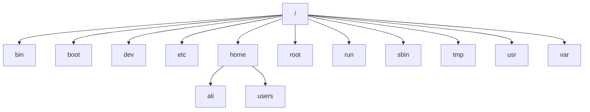

# Manage Files from the Command Line


## Describe Linux File System Hierarchy Concepts

The File-system Hierarchy chart:



### Describe Linux File System Hierarchy

File System Hierarchy Standard

Dosyalarin ve dizinlerin nasil organize edildigi. Hangi dizinin altında neler saklandigi ve saklanabilecegi bu standartda belirlenir.(Unix ve Linux'da aynidir)


asagidaki ciktida l ile baslyanlar soft link d ile baslayan dizin(directory'dir)
```sh
[root@rocky2 /]# ll
total 28
dr-xr-xr-x.   2 root root    6 May 16  2022 afs
lrwxrwxrwx.   1 root root    7 May 16  2022 bin -> usr/bin
dr-xr-xr-x.   5 root root 4096 Mar  2 15:07 boot
drwxr-xr-x.  20 root root 3320 Mar  8 19:19 dev
drwxr-xr-x.  80 root root 8192 Mar  8 19:25 etc
drwxr-xr-x.  20 root root 4096 Mar  3 03:49 home
lrwxrwxrwx.   1 root root    7 May 16  2022 lib -> usr/lib
lrwxrwxrwx.   1 root root    9 May 16  2022 lib64 -> usr/lib64
drwxr-xr-x.   2 root root    6 May 16  2022 media
drwxr-xr-x.   2 root root    6 May 16  2022 mnt
drwxr-xr-x.   2 root root    6 May 16  2022 opt
dr-xr-xr-x. 208 root root    0 Mar  8 19:18 proc
dr-xr-x---.   4 root root  183 Mar  6 21:27 root
drwxr-xr-x.  27 root root  800 Mar  8 19:19 run
lrwxrwxrwx.   1 root root    8 May 16  2022 sbin -> usr/sbin
drwxr-xr-x.   2 root root    6 May 16  2022 srv
dr-xr-xr-x.  13 root root    0 Mar  8 19:19 sys
drwxrwxrwt.   6 root root 4096 Mar  8 19:34 tmp
drwxr-xr-x.  12 root root  144 Feb 25 20:05 usr
drwxr-xr-x.  20 root root 4096 Feb 28 05:11 var
```

### Significant Red Hat Enterprise Linux Directories

#### root

Root kullanıcısınn home dizinidir.

#### Home

Oluşturulan kullanicilarin default home dizinidir.

#### bin / sbin

User-Kullanici seviyesinde saklanan komutlar Bin klasörü altında saklanir. Regular user'lar calistirabilir

Sbin dizininde yetkili user'lar calistirabilir. Bu betikler  C dilinde yazilmistir.

Bu dizinler ilgili betik silinirse komut calismaz. Farkli bir sunucudan ayni betik dizine kopyalanirsa betik celisabilir duruma gelir

```sh
[root@rocky2 sbin]# mv useradd useradd.bak
[root@rocky2 sbin]# useradd
bash: useradd: command not found
[root@rocky2 sbin]#
[root@rocky2 sbin]# mv useradd.bak useradd
[root@rocky2 sbin]# useradd
Usage: useradd [options] LOGIN
       useradd -D
       useradd -D [options]

Options:
      --badname                 do not check for bad names
  -b, --base-dir BASE_DIR       base directory for the home directory of the
                                new account
      --btrfs-subvolume-home    use BTRFS subvolume for home directory
```


Uc tip user seviyesi bulunamaktadır.

Regular user

System user

Root user


#### etc


Os servislerinin ve sonradan kurulan servislerin sistem yapılandirma dosyalaridir.  Yapilandirmayi ne varsa /etc altinda yer alir.

DNS, SSH, IP, WEB, FW, etc.


#### var

Desisken data'ların tutulduğu dizindir. Dinamiz degiskenlerin hepsi burada saklanir . 

Log'lar Cache , mail log'ları, print spooler, Rsyslog

```sh
[root@rocky2 log]# ll /var/log
total 1912
drwxr-xr-x. 2 root   root     4096 Feb 25 20:09 anaconda
drwx------. 2 root   root       23 Feb 25 20:09 audit
-rw-------. 1 root   root       61 Mar  2 23:52 boot.log
-rw-rw----. 1 root   utmp     4224 Mar  6 21:28 btmp
-rw-rw----. 1 root   utmp        0 Feb 25 20:05 btmp-20240302
drwxr-x---. 2 chrony chrony      6 Apr 17  2023 chrony
```

#### tmp

Geçici dosyaların bulundugu. Her yeniden baslatmada silinir. Saatlik sinirlamada yapılabilmektedir 8 saat 24 saat


/var/tmp bu dizinde saklanan veriler 30 gun boyunca saklanır.  Gunu ayarlanabilmektedir. 30 gun sonunda silinir. Reboot ile silinmez


#### boot

EFI ve boot burada yer alir. İsletim sisteminin acilmasi icindir


#### dev

Donanım bilgileri yer alır. Speacial device

Soket bilgileri, tty (interactive connection-terminal- Tele type)


