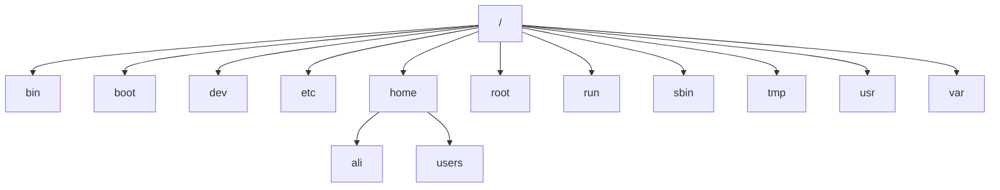

# Manage Files from the Command Line

## Describe Linux File System Hierarchy Concepts

The File-system Hierarchy chart:

### Describe Linux File System Hierarchy

File System Hierarchy Standard

Dosyalarin ve dizinlerin nasil organize edildigi. Hangi dizinin altında neler saklandigi ve saklanabilecegi bu standartda belirlenir.

### Significant Red Hat Enterprise Linux Directories

#### root

Root kullanıcısınn home dizinidir.

#### Home

Oluşturulan kullanicilarin default home dizinidir.

