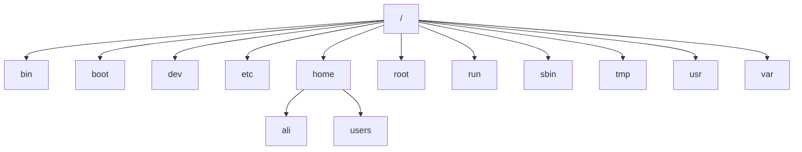

# Manage Files from the Command Line

## Describe Linux File System Hierarchy Concepts

The File-system Hierarchy chart:

```mermaid
graph TD;
    /-->bin;
    /-->boot;
    /-->dev;
    /-->etc;
    /-->home;
    /-->root;
    /-->run;
    /-->sbin;
    /-->tmp;
    /-->usr;
    /-->var;
    home-->ali;
    home-->users;
```

