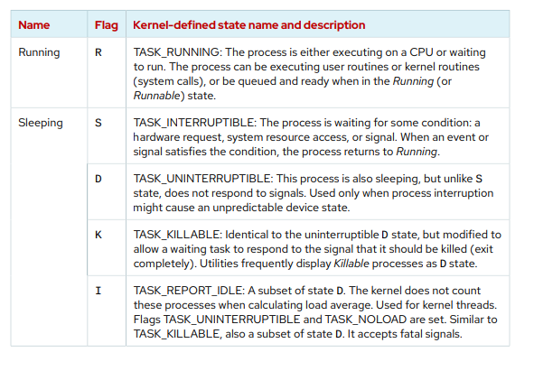
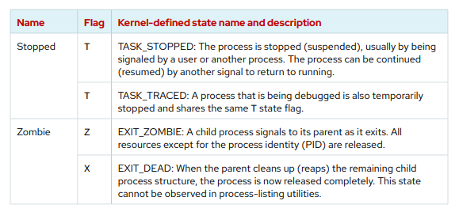

# Monitor and Manage Linux Processes

## Process States and Lifecycle 

Tüm işletim sistemlerinde olduğu gibi Linux işletim sistemlerinde de bir process süreci bulunmaktadır. Tüm process (işlemlerin) seri numarası gibi bir PID numarası bulunmaktadır. Her process'in kendine ait benzersiz bir PID'si bulunur. Her process'e allocate edilmiş bir ram bulunur. Bu process'in kime ait olduğuna dair bilgi mevcuttur. Her bir process'in bir chain proccessi bulunabilir. Yada bu process doğrudan sadece kendisi çalışabilir.





## Linux Process States (Linux İşlem Durumları)
### Running
R --> Process Çalıştırılıyor.
### Sleeping
S --> Process uyku modunda, bekliyor.
D --> Process uykudadır ancak "S" modunda farklı olarak sinyallere cevap vermez.
K --> Process D durumuyla aynıdır, ancak bekleyen bir görevin sonlandırılması gerektiği sinyaline yanıt vermesine izin verecek şekildedir.
I --> D processin bir alt kümesi. Çekirdek, yük ortalamasını hesaplarken bu işlemleri saymaz. Çekirdek iş parçacıkları için kullanılır.
### Stopped
Task Stopped "T" --> Process, genellikle bir kullanıcı veya başka bir işlem tarafından sinyal verilerek durdurulur (askıya alınır). İşlem, çalışmaya geri dönmek için başka bir sinyalle devam ettirilebilir
Task Traced --> Hata ayıklanmakta olan bir süreç de geçici olarak durdurulur ve aynı T durumu bayrağını paylaşır.

### Zombie
Z EXIT_ZOMBIE: Bir alt süreç, çıkarken main process'e sinyal gönderir. İşlem kimliği (PID) dışındaki tüm kaynaklar serbest bırakılır.

Zombie X EXIT_DEAD: Main Process kalan alt süreç yapısını temizlediğinde (topladığında), süreç artık tamamen serbest bırakılır. Bu durum süreç listeleme yardımcı programlarında gözlemlenemez.

Aktif processleri aşağıdaki gibi görüntüleyebiliriz.

```ssh
[user@host ~]$ top
PID USER PR NI VIRT RES SHR S %CPU %MEM TIME+ COMMAND
2259 root 20 0 270856 40316 8332 S 0.3 0.7 0:00.25 sssd_kcm
 1 root 20 0 171820 16140 10356 S 0.0 0.3 0:01.62 systemd
 2 root 20 0 0 0 0 S 0.0 0.0 0:00.00 kthreadd
...output omitted...
```
```ssh 
[user@host ~]$ ps aux
USER PID %CPU %MEM VSZ RSS TTY STAT START TIME COMMAND
...output omitted...
root 2 0.0 0.0 0 0 ? S 11:57 0:00 [kthreadd]
student 3448 0.0 0.2 266904 3836 pts/0 R+ 18:07 0:00 ps aux
...output omitted...
```

```ssh
[user@host ~]$ ps -ef
UID PID PPID C STIME TTY TIME CMD
root 1 0 0 16:47 ? 00:00:01 /usr/lib/systemd/systemd ...
root 2 0 0 16:47 ? 00:00:00 [kthreadd]
root 3 2 0 16:47 ? 00:00:00 [rcu_gp]
root 4 2 0 16:47 ? 00:00:00 [rcu_par_gp]
root 6 2 0 16:47 ? 00:00:00 [kworker/0:0H-events_highpri]
...output omitted...
```
```ssh
[user@host ~]$ ps -ef | grep process_name
UID PID PPID C STIME TTY TIME CMD
root 1 0 0 16:47 ? 00:00:01 /usr/lib/systemd/systemd ...
root 2 0 0 16:47 ? 00:00:00 [kthreadd]
root 3 2 0 16:47 ? 00:00:00 [rcu_gp]
root 4 2 0 16:47 ? 00:00:00 [rcu_par_gp]
root 6 2 0 16:47 ? 00:00:00 [kworker/0:0H-events_highpri]
...output omitted...
```

##Run Jobs in the Background

```ssh
[user@host ~]$ sleep 10000 &
[1] 5947
[user@host ~]$
```

```ssh
[user@host ~]$ jobs
[1]+ Running sleep 10000 &
[user@host ~]$
```
Bir arka plan işini ön plana getirmek için fg komutunu kullanılır.
```ssh
[user@host ~]$ fg %1
sleep 10000
```
## Kill Processes

```ssh
[user@host ~]$ ps aux | grep job
5194 0.0 0.1 222448 2980 pts/1 S 16:39 0:00 /bin/bash /home/user/bin/control job1
5199 0.0 0.1 222448 3132 pts/1 S 16:39 0:00 /bin/bash /home/user/bin/control job2
5205 0.0 0.1 222448 3124 pts/1 S 16:39 0:00 /bin/bash /home/user/bin/control job3
5430 0.0 0.0 221860 1096 pts/1 S+ 16:41 0:00 grep --color=auto job
[user@host ~]$ kill 5194
[user@host ~]$ ps aux | grep job
user 5199 0.0 0.1 222448 3132 pts/1 S 16:39 0:00 /bin/bash /home/
user/bin/control job2
user 5205 0.0 0.1 222448 3124 pts/1 S 16:39 0:00 /bin/bash /home/
user/bin/control job3
user 5783 0.0 0.0 221860 964 pts/1 S+ 16:43 0:00 grep --color=auto
 job
[1] Terminated control job1
[user@host ~]$ kill -9 5199
[user@host ~]$ ps aux | grep job
user 5205 0.0 0.1 222448 3124 pts/1 S 16:39 0:00 /bin/bash /home/
user/bin/control job3
```

## Monitor Process Activity
```ssh
[user@host ~]$ uptime
 15:29:03 up 14 min, 2 users, load average: 2.92, 4.48, 5.20

[user@host ~]$ lscpu
Architecture: x86_64
CPU op-mode(s): 32-bit, 64-bit
Byte Order: Little Endian
CPU(s): 4
On-line CPU(s) list: 0-3
Thread(s) per core: 2
Core(s) per socket: 2
Socket(s): 1
NUMA node(s): 1
...output omitted...
```


LAB 242--> 246
LAB 261--> 264

