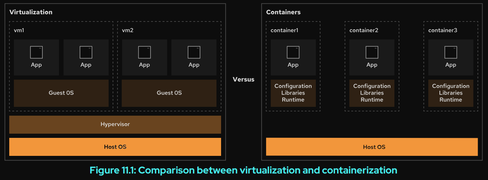

# Container Concepts


## Container Technology


Software applications typically depend on system libraries, configuration files, or services
that their runtime environment provides. Traditionally, the runtime environment for a software
application is installed in an operating system that runs on a physical host or virtual machine.
Administrators then install application dependencies on top of the operating system.

In Red Hat Enterprise Linux, packaging systems such as RPM help administrators to manage
application dependencies. When you install the httpd package, the RPM system ensures that the
correct libraries and other dependencies for that package are also installed.

The major drawback to traditionally deployed software applications is that these dependencies are
entangled with the runtime environment. An application might require older or newer versions of
supporting software than the software that is provided with the operating system. Similarly, two
applications on the same system might require different and incompatible versions of the same
software.
One way to resolve these conflicts is to package and deploy the application as a container.
A container is a set of one or more processes that are isolated from the rest of the system.
Software containers provide a way to package applications and to simplify their deployment and
management.

Think of a physical shipping container. A shipping container is a standard way to package and ship
goods. It is labeled, loaded, unloaded, and transported from one location to another as a single
box. The container's contents are isolated from the contents of other containers so that they do
not affect each other. These underlying principles also apply to software containers.

Red Hat Enterprise Linux supports containers by using the following core technologies:

• Control Groups (cgroups) for resource management.

• Namespaces for process isolation.

• SELinux and Seccomp (Secure Computing mode) to enforce security boundaries.


Differences Between Containers and Virtual Machines

Containers provide many of the same benefits as virtual machines, such as security, storage, and
network isolation.

Both technologies isolate their application libraries and runtime resources from the host operating
system or hypervisor and vice versa.




Containers and virtual machines interact differently with hardware and the underlying operating
system.

A virtual machine has the following characteristics:

• Enables multiple operating systems to run simultaneously on a single hardware platform.

• Uses a hypervisor to divide hardware into multiple virtual hardware systems.

• Requires a complete operating system environment to support the application.


A container has the following characteristics:


• Runs directly on the host operating system, and it shares resources with all containers on the
system.

• Shares the host's kernel, but it isolates the application processes from the rest of the system.

• Requires far fewer hardware resources than virtual machines, so containers are also quicker to
start.

• Includes all dependencies such as system and programming dependencies, and configuration
settings.


Rootless and Rootful Containers

On the container host, you can run containers as the root user or as a regular, unprivileged user.
Containers that a privileged user runs are called rootful containers. Containers that non-privileged
users run are called rootless containers.

A rootless container is not allowed to use system resources that are usually reserved for privileged
users, such as access to restricted directories, or to publish network services on restricted ports
(those ports below 1024). This feature prevents a possible attacker from gaining root privileges on
the container host.

You can run containers directly as root if necessary, but this scenario weakens the security of the
system if a bug allows an attacker to compromise the container.

Design a Container-based Architecture

Containers are an efficient way to reuse hosted applications and to make them portable.
Containers can be easily moved from one environment to another, such as from development to
production. You can save multiple versions of a container and quickly access each one as needed.

Containers are typically temporary, or ephemeral. You can permanently save in persistent storage
the data that a running container generates, but the containers themselves usually run when
needed, and then stop and are removed. A new container process is started the next time that
particular container is needed.

You could install a complex software application with multiple services in a single container. For
example, a web server might need to use a database and a messaging system. However, using one
container for multiple services is hard to manage.

A better design runs in separate containers each component, the web server, the database, and
the messaging system. This way, updates and maintenance to individual application components
do not affect other components or the application stack.


Container Management Tools

Red Hat Enterprise Linux provides a set of container tools that you can use to run containers in a
single server.

• podman manages containers and container images.

• skopeo inspects, copies, deletes, and signs images.

• buildah creates container images.


These tools are compatible with the Open Container Initiative (OCI). With these tools, you
can manage any Linux containers that are created by OCI-compatible container engines, such
as Podman or Docker. These tools are specifically designed to run containers under Red Hat
Enterprise Linux on a single-node container host.

In this chapter, you use the podman and skopeo utilities to run and manage containers and
existing container images.


## Container Images and Registries

To run containers, you must use a container image. A container image is a static file that contains
codified steps, and it serves as a blueprint to create containers. The container images package an
application with all its dependencies, such as its system libraries, programming language runtimes
and libraries, and other configuration settings.

Container images are built according to specifications, such as the Open Container Initiative (OCI)
image format specification. These specifications define the format for container images, as well
as the metadata about the container host operating systems and hardware architectures that the
image supports.

A container registry is a repository for storing and retrieving container images. A developer pushes
or uploads container images to a container registry. You can pull or download container images
from a registry to a local system to run containers.


You might use a public registry that contains third-party images, or you might use a private
registry that your organization controls. The source of your container images matters. As with any
other software package, you must know whether you can trust the code in the container image.
Policies vary between registries about whether and how they provide, evaluate, and test container
images that are submitted to them.


Red Hat distributes certified container images through two main container registries that you can
access with your Red Hat login credentials.


• registry.redhat.io for containers that are based on official Red Hat products.

• registry.connect.redhat.com for containers that are based on third-party products.

The Red Hat Container Catalog (https://access.redhat.com/containers) provides a web-based
interface to search these registries for certified content.

You need a Red Hat Developer account to download an image from the Red Hat registries. You
can use the podman login command to authenticate to the registries. If you do not provide a
registry URL to the podman login command, then it authenticates to the default configured
registry.

```sh
[user@host ~]$ podman login registry.lab.example.com
Username: RH134
Password: EXAMPLEPASSWORD
Login Succeeded!

```


You can also use the podman login command --username and --password-stdin options,
to specify the user and password to log in to the registry. The --password-stdin option reads
the password from stdin. Red Hat does not recommend to use the --password option to provide
the password directly, as this option stores the password in the log files.


```sh
[user@host ~]# echo $PASSWORDVAR | podman login --username RH134 \
--password-stdin registry.access.redhat.com
```


To verify that you are logged in to a registry, use the podman login command --get-login
option.

```sh
[user01@rhel-vm ~]$ podman login registry.access.redhat.com --get-login
RH134
[user01@rhel-vm ~]$ podman login quay.io --get-login
Error: not logged into quay.io
```


In the preceding output, the podman utility is authenticated to the
registry.access.redhat.com registry with the RH134 user credentials, but the podman
utility is not authenticated to the quay.io registry.

Configure Container Registries

The default configuration file for container registries is the /etc/containers/
registries.conf file.


```sh
[user@host ~]$ cat /etc/containers/registries.conf
...output omitted...
[registries.search]
registries = ['registry.redhat.io', 'quay.io', 'docker.io']
# If you need to access insecure registries, add the registry's fully-qualified
 name.
# An insecure registry is one that does not have a valid SSL certificate or only
 does HTTP.
[registries.insecure]
registries = []
...output omitted...
```

Because Red Hat recommends to use a non-privileged user to manage containers, you can
create a registries.conf file for container registries in the $HOME/.config/containers
directory. The configuration file in this directory overrides the settings in the /etc/containers/
registries.conf file.


The list of registries to look for containers is configured in the [registries.search] section of
this file. If you specify the fully qualified name of a container image from the command line, then
the container utility does not search in this section.


Insecure registries are listed in the [registries.insecure] section of the registries.conf
file. If a registry is listed as insecure, then connections to that registry are not protected with
TLS encryption. If a registry is both searchable and insecure, then it can be listed in both
[registries.search] and [registries.insecure].


Container Files to Build Container Images

A container file is a text file with the instructions to build a container image. A container file usually
has a context that defines the path or URL where its files and directories are located. The resulting
container image consists of read-only layers, where each layer represents an instruction from the
container file.

The following output is an example of a container file that uses the UBI image from the
registry.access.redhat.com registry, installs the python3 package, and prints the hello
string to the console.

```sh
[user@host ~]$ cat Containerfile
FROM registry.access.redhat.com/ubi8/ubi:latest
RUN dnf install -y python3
CMD ["/bin/bash", "-c", "echo hello"]
```

## Container Management at Scale

New applications increasingly use containers to implement functional components. Those
containers provide services that other parts of the application consume. In an organization,
managing a growing number of containers might quickly become an overwhelming task.

Deploying containers at scale in production requires an environment that can adapt to the
following challenges:


• The platform must ensure the availability of containers that provide essential services.

• The environment must respond to application usage spikes by increasing or decreasing the
number of running containers and load balancing the traffic.

• The platform must detect the failure of a container or a host and react accordingly.

• Developers might need an automated workflow to deliver new application versions transparently
and securely.


Kubernetes is an orchestration service that deploys, manages, and scales container-based
applications across a cluster of container hosts. Kubernetes redirects traffic to your containers
with a load balancer, so that you can scale the number of containers that provide a service.
Kubernetes also supports user-defined health checks to monitor your containers and to restart
them if they fail.


Red Hat provides a distribution of Kubernetes called Red Hat OpenShift. Red Hat OpenShift is a
set of modular components and services that are built on top of the Kubernetes infrastructure. It
provides additional features, such as remote web-based management, multitenancy, monitoring
and auditing, advanced security features, application lifecycle management, and self-service
instances for developers.


# Deploy Containers


The Podman Utility

Podman is a fully featured container engine from the container-tools meta-package to
manage Open Container Initiative (OCI) containers and images. The podman utility does not use
a daemon to function, and so developers do not need a privileged user account on the system to
start or stop containers. Podman provides multiple subcommands to interact with containers and
images. The following list shows subcommands that are used in this section:


| Command | Description |
|---------|-------------|
| podman-build | Build a container image with a container file. |
| podman-run | Run a command in a new container. |
| podman-images | List images in local storage. |
| podman-ps | Print information about containers. |
| podman-inspect | Display configuration of a container, image, volume, network, or pod. |
| podman-pull | Download an image from a registry. |
| podman-cp | Copy files or folders between a container and the local file system. |
| podman-exec | Execute a command in a running container. |
| podman-rm | Remove one or more containers. |
| podman-rmi | Remove one or more locally stored images. |
| podman-search | Search a registry for an image. |


As a system administrator, you are tasked to run a container that is based on the RHEL 8 UBI
container image called python38 with the python-38 package. You are also tasked to create a
container image from a container file and run a container called python36 from that container
image. The container image that is created with the container file must have the python36:1.0
tag. Identify the differences between the two containers. Also ensure that the installed python
packages in the containers do not conflict with the installed Python version in your local machine.


## Install Container Utilities


The container-tools meta-package contains required utilities to interact with containers
and container images. To download, run, and compare containers on your system, you install
the container-tools meta-package with the dnf install command. Use the dnf info
command to view the version and contents of the container-tools package.


```sh
[root@host ~]# dnf install container-tools
...output omitted...
[user@host ~]$ dnf info container-tools
...output omitted...
Summary : A meta-package witch container tools such as podman, buildah,
 : skopeo, etc.
License : MIT
Description : Latest versions of podman, buildah, skopeo, runc, conmon, CRIU,
 : Udica, etc as well as dependencies such as container-selinux
 : built and tested together, and updated.
...output omitted...

```


The container-tools meta-package provides the needed podman and skopeo utilities to
achieve the assigned tasks.


Download a Container Image from a Registry


First, you ensure that the podman utility is configured to search and download containers from the
registry.redhat.io registry. The podman info command displays configuration information
of the podman utility, including the configured registries.

```sh
[user@host ~]$ podman info
...output omitted...
insecure registries:
 registries: []
registries:
 registries:
 #onemli kisim burasidir. Image dosyalarini indirmek icin buradaki repo'lar kullanilir.
 - registry.redhat.io
 - quay.io
 - docker.io
...output omitted...
```


The podman search command searches for a matching image in the list of configured registries.
By default, Podman searches in all unqualified-search registries. Depending on the Docker
distribution API that is implemented with the registry, some registries might not support the
search feature.


Use the podman search command to display a list of images on the configured registries that
contain the python-38 package.

```sh
#image aramak icin kullanilir
[user@host ~]$ podman search python-38
NAME DESCRIPTION
registry.access.redhat.com/ubi7/python-38 Python 3.8 platform for building and
 running applications
registry.access.redhat.com/ubi8/python-38 Platform for building and running
 Python 3.8 applications
...output omitted...
```

The registry.access.redhat.com/ubi8/python-38 image seems to match the criteria for
the required container.

You can use the skopeo inspect command to examine different container image formats
from a local directory or a remote registry without downloading the image. This command output
displays a list of the available version tags, exposed ports of the containerized application, and
metadata of the container image. You use the skopeo inspect command to verify that the
image contains the required python-38 package.

bir imajin detaylarini gormek icin kullaniriz. Json formatlı görüntülenir.

```sh
[user@host ~]$ skopeo inspect docker://registry.access.redhat.com/ubi8/python-38
{
 "Name": "registry.access.redhat.com/ubi8/python-38",
 "Digest":
 "sha256:c6e522cba2cf2b3ae4a875d5210fb94aa1e7ba71b6cebd902a4f4df73cb090b8",
 "RepoTags": [
...output omitted...
 "1-68",
 "1-77-source",
 "latest"
...output omitted...
 "name": "ubi8/python-38",
 "release": "86.1648121386",
 "summary": "Platform for building and running Python 3.8 applications",
...output omitted...
```

The registry.access.redhat.com/ubi8/python-38 image contains the required package
and it is based on the required image. You use the podman pull command to download the
selected image to the local machine. You can use the fully qualified name of the image from the
preceding output to avoid ambiguity on container versions or registries.

indirmek icin kullanilir.

```sh
[user@host ~]$ podman pull registry.access.redhat.com/ubi8/python-38
Trying to pull registry.access.redhat.com/ubi8/python-38:latest...
Getting image source signatures
Checking if image destination supports signatures
Copying blob c530010fb61c done
...output omitted...
```


Then, you use the podman images command to display the local images.


```sh
[user@host ~]$ podman images
REPOSITORY TAG IMAGE ID CREATED SIZE
registry.access.redhat.com/ubi8/python-38 latest a33d92f90990 1 hour ago 901 MB

```


## Create a Container Image from a Container File


You are provided with the following container file to create the container image in the python36-
app directory:

```sh
[user@host python36-app]$ cat Containerfile
FROM registry.access.redhat.com/ubi8/ubi:latest
RUN dnf install -y python36
CMD ["/bin/bash", "-c", "sleep infinity"]
```


The previous container file uses the registry.access.redhat.com/ubi8/ubi:latest
image as the base image. The container file then installs the python36 package and runs the
sleep infinity bash command to prevent the container from exiting.

Normally, a container runs a process, and then exits after that process is complete. The sleep
infinity command prevents the container from exiting, because the process never completes.
You can then test, develop, and debug inside the container

After examining the container file, you use the podman build command to build the image.
The podman build command builds a container image by using instructions from one or more
container files. You must be in the directory with the container file to build the image with the
podman build command. You can use the podman build command -t option to provide the
name and python36:1.0 tag for the new image.


```sh
[user@host python36-app]$ podman build -t python36:1.0 .
STEP 1/3: FROM registry.access.redhat.com/ubi8/ubi:latest
STEP 2/3: RUN dnf install -y python36
...output omitted...
STEP 3/3: CMD ["/bin/bash", "-c", "sleep infinity"]
COMMIT python36:1.0
--> 35ab820880f
Successfully tagged localhost/python36:1.0
35ab820880f1708fa310f835407ffc94cb4b4fe2506b882c162a421827b156fc
```

The last line of the preceding output shows the container image ID. Most Podman commands
use the first 12 characters of the container image ID to refer to the container image. You can use
this short ID or the name of a container or a container image as arguments for most Podman
commands.


Note

If a version number is not specified in the tag, then the image is created with the
:latest tag. If an image name is not specified, then the image and tag fields show
the <none> string.


You use the podman images command to verify that the image is created with the defined name
and tag.

```sh
[user@host ~]$ podman images
REPOSITORY TAG IMAGE ID CREATED SIZE
localhost/python36 1.0 35ab820880f1 3 minute ago 266 MB
registry.access.redhat.com/ubi8/python-38 latest a33d92f90990 1 hour ago 901 MB
```


You then use the podman inspect command to view the low-level information of the container
image and verify that its content matches the requirements for the container.

```sh
[user@host ~]$ podman inspect localhost/python36:1.0
...output omitted...
 "Cmd": [
 "/bin/bash",
 "-c",
 "sleep infinity"
 ],
...output omitted...
 {
 "created": "2022-04-18T19:47:52.708227513Z",
 "created_by": "/bin/sh -c dnf install -y python36",
 "comment": "FROM registry.access.redhat.com/ubi8/ubi:latest"
 },
...output omitted...
```

The output of the podman inspect command shows the registry.access.redhat.com/
ubi8/ubi:latest base image, the dnf command to install the python36 package, and the
sleep infinity bash command that is executed at runtime to prevent the container from
exiting.


Note

The podman inspect command output varies from the python-38 image to
the python36 image, because you created the /python36 image by adding a
layer with changes to the existing registry.access.redhat.com/ubi8/
ubi:latest base image, whereas the python-38 image is itself a base image


## Run Containers


Now that you have the required container images, you can use them to run containers. A container
can be in one of the following states:

Created

A container that is created but is not started.

Running

A container that is running with its processes.

Stopped

A container with its processes stopped.

Paused

A container with its processes paused. Not supported for rootless containers.

Deleted

A container with its processes in a dead state.

The podman ps command lists the running containers on the system. Use the podman ps -a
command to view all containers (created, stopped, paused, or running) in the machine.

You use the podman create command to create the container to run later. To create the
container, you use the ID of the localhost/python36 container image. 

You also use the --name option to set a name to identify the container. The output of the command is the long ID of
the container.

```sh
[user@host ~]$ podman create --name python36 dd6ca291f097
c54c7ee281581c198cb96b07d78a0f94be083ae94dacbae69c05bd8cd354bbec
```


Note

If you do not set a name for the container with the podman create or podman
run command with the --name option, then the podman utility assigns a random
name to the container.


You then use the podman ps and podman ps -a commands to verify that the container is
created but is not started. You can see information about the python36 container, such as
the short ID, name, and the status of the container, the command that the container runs when
started, and the image to create the container.

```sh
[user@host ~]$ podman create --name python36 dd6ca291f097
c54c7ee281581c198cb96b07d78a0f94be083ae94dacbae69c05bd8cd354bbec
[user@host ~]$ podman ps
CONTAINER ID IMAGE COMMAND CREATED STATUS PORTS NAMES
[user@host ~]$ podman ps -a
CONTAINER ID IMAGE COMMAND CREATED STATUS 
 PORTS NAMES
c54c7ee28158 localhost/python36:1.0 /bin/bash -c slee... 5 seconds ago Created
 python36
```

Now that you verified that the container is created correctly, you decide to start the container,
so you run the podman start command. You can use the name or the container ID to start the
container. The output of this command is the name of the container.


```sh
[user@host ~]$ podman start python36
python36
[user@host ~]$ podman ps
CONTAINER ID IMAGE COMMAND CREATED STATUS 
 PORTS NAMES
c54c7ee28158 localhost/python36:1.0 /bin/bash -c slee... 6 minutes ago Up 3
 seconds ago python36
```

## Run a Container from a Remote Repository

You can use the podman run command to create and run the container in one step. The podman
run command runs a process inside a container, and this process starts the new container.

You use the podman run command -d option to run a container in detached mode, which runs
the container in the background instead of in the foreground of the session. In the example of the
python36 container, you do not need to provide a command for the container to run, because the
sleep infinity command was already provided in the container file that created the image for
that container.

To create the python38 container, you decide to use the podman run command and to refer
to the registry.access.redhat.com/ubi8/python-38 image. You also decide to use the
sleep infinity command to prevent the container from exiting.

```sh
[user@host ~]$ podman run -d --name python38 \
registry.access.redhat.com/ubi8/python-38 \
sleep infinity
a60f71a1dc1b997f5ef244aaed232e5de71dd1e8a2565428ccfebde73a2f9462
[user@host ~]$ podman ps
CONTAINER ID IMAGE COMMAND 
 CREATED STATUS PORTS NAMES
c54c7ee28158 localhost/python36:1.0 /bin/bash -c
 slee... 37 minutes ago Up 30 minutes ago python36
a60f71a1dc1b registry.access.redhat.com/ubi8/python-38:latest sleep infinity 
 32 seconds ago Up 33 seconds ago python38
```


## Environment Isolation in Containers

Containers isolate the environment of an application. Each container has its own file system,
networking, and processes. You can notice the isolation feature when you look at the output of the
ps command and compare it between the host machine and a running container.

You first run the ps -ax command on the local machine and the command returns an expected
result with many processes.


```sh
[root@host ~]# ps -ax
 PID TTY STAT TIME COMMAND
 1 ? Ss 0:01 /usr/lib/systemd/systemd --switched-root --system --
deseriali
 2 ? S 0:00 [kthreadd]
 3 ? I< 0:00 [rcu_gp]
 4 ? I< 0:00 [rcu_par_gp]
...output omitted...

```

The podman exec command executes a command inside a running container. The command
takes the name or ID of the container as the first argument and the following arguments as
commands to run inside the container. You use the podman exec command to view the running
processes in the python36 container. The output from the ps aux command looks different,
because it is running different processes from the local machine.


```sh
[student@host ~]$ podman exec python38 ps -ax
 PID TTY STAT TIME COMMAND
 1 ? Ss 0:00 /usr/bin/coreutils --coreutils-prog-shebang=sleep /
usr/bin/sleep infinity
 7 ? R 0:00 ps -ax
```


You can use the sh -c command to encapsulate the command to execute in the container. In the
following example, the ps -ax > /tmp/process-data.log command is interpreted as the
command to be executed in the container. If you do not encapsulate the command, then Podman
might interpret the greater-than character (>) as part of the podman command instead of as an
argument to the podman exec option.


```sh
[student@host ~]$ podman exec python38 sh -c 'ps -ax > /tmp/process-data.log'
 PID TTY STAT TIME COMMAND
 1 ? Ss 0:00 /usr/bin/coreutils --coreutils-prog-shebang=sleep /
usr/bin/sleep infinity
 7 ? R 0:00 ps -ax
```


You decide to compare the installed python version on the host system with the installed python
version on the containers.


```sh
[user@host ~]$ python3 --version
Python 3.9.10
[user@host ~]$ podman exec python36 python3 --version
Python 3.6.8
[user@host ~]$ podman exec python38 python3 --version
Python 3.8.8

```

File-system Isolation in Containers


Developers can use the file-system isolation feature to write and test applications for different
versions of programming languages without the need to use multiple physical or virtual machines.

You create a simple bash script that displays hello world on the terminal in the /tmp directory.


```sh
[user@host ~]$ echo "echo 'hello world'" > /tmp/hello.sh
```

The /tmp/hello.sh file exists on the host machine, and does not exist on the file system inside
the containers. If you try to use the podman exec to execute the script, then it gives an error,
because the /tmp/hello.sh script does not exist in the container.


```sh
[user@host ~]$ stat /tmp/hello.sh
 File: /tmp/hello.sh
 Size: 19 Blocks: 8 IO Block: 4096 regular file
Device: fc04h/64516d Inode: 17655599 Links: 1
Access: (0644/-rw-r--r--) Uid: ( 1000/ user) Gid: ( 1000/ user)
Context: unconfined_u:object_r:user_tmp_t:s0
Access: 2022-04-19 21:47:40.101601412 -0400
Modify: 2022-04-19 21:47:36.497558132 -0400
Change: 2022-04-19 21:47:36.497558132 -0400
 Birth: 2022-04-19 21:45:24.785976758 -0400
[user@host ~]$ podman exec python38 stat /tmp/hello.sh
stat: cannot statx '/tmp/hello.sh': No such file or directory

```

The podman cp command copies files and folders between host and container file systems. You
can copy the /tmp/hello.sh file to the python38 container with the podman cp command.


```sh
[user@host ~]$ podman cp /tmp/hello.sh python38:/tmp/hello.sh
[user@host ~]$ podman exec python38 stat /tmp/hello.sh
 File: /tmp/hello.sh
 Size: 19 Blocks: 8 IO Block: 4096 regular file
Device: 3bh/59d Inode: 12280058 Links: 1
Access: (0644/-rw-r--r--) Uid: ( 1001/ default) Gid: ( 0/ root)
Access: 2022-04-20 01:47:36.000000000 +0000
Modify: 2022-04-20 01:47:36.000000000 +0000
Change: 2022-04-20 02:02:04.732982187 +0000
 Birth: 2022-04-20 02:02:04.732982187 +0000
```


After the script is copied to the container file system, it can be executed from within the container


```sh
[user@host ~]$ podman exec python38 bash /tmp/hello.sh
hello world
```


## Remove Containers and Images

You can remove containers and images by using the podman rm and podman rmi commands,
respectively. Before you remove a container image, any existing running containers from that
image must be removed.

You decide to remove the python38 container and its related image. If you attempt to remove
the registry.access.redhat.com/ubi8/python-38 image while the python38 container
exists, then it gives an error.

```sh
[user@host ~]$ podman rmi registry.access.redhat.com/ubi8/python-38
Error: Image used by
 a60f71a1dc1b997f5ef244aaed232e5de71dd1e8a2565428ccfebde73a2f9462: image is in use
 by a container
```

You must stop the container before you can remove it. To stop a container, use the podman stop
command.

```sh
[user@host ~]$ podman stop python38
```


After you stop the container, use the podman rm command to remove the container.


```sh
[user@host ~]$ podman rm python38
a60f71a1dc1b997f5ef244aaed232e5de71dd1e8a2565428ccfebde73a2f9462
```


When the container no longer exists, the registry.access.redhat.com/ubi8/python-38
can be removed with the podman rmi command.

```sh
[user@host ~]$ podman rmi registry.access.redhat.com/ubi8/python-38
Untagged: registry.access.redhat.com/ubi8/python-38:latest
Deleted: a33d92f90990c9b1bad9aa98fe017e48f30c711b49527dcc797135352ea57d12
```


```sh
[root@rocky2 ~]# vi Containerfile

FROM docker.io/library/nginx
RUN apt update
~        


[root@rocky2 ~]# podman build -t myimage:v1 .
STEP 1/2: FROM docker.io/library/nginx
Trying to pull docker.io/library/nginx:latest...
Getting image source signatures
Copying blob 14b7e5e8f394 done   |
Copying blob e4fff0779e6d done   |
Copying blob 2a0cb278fd9f done   |
Copying blob 7045d6c32ae2 done   |
Copying blob 03de31afb035 done   |
Copying blob 0f17be8dcff2 done   |
Copying blob 23fa5a7b99a6 done   |
Copying config 5ef79149e0 done   |
Writing manifest to image destination
STEP 2/2: RUN apt update

WARNING: apt does not have a stable CLI interface. Use with caution in scripts.

Get:1 http://deb.debian.org/debian bookworm InRelease [151 kB]
Get:2 http://deb.debian.org/debian bookworm-updates InRelease [55.4 kB]
Get:3 http://deb.debian.org/debian-security bookworm-security InRelease [48.0 kB]
Get:4 http://deb.debian.org/debian bookworm/main amd64 Packages [8788 kB]
Get:5 http://deb.debian.org/debian bookworm-updates/main amd64 Packages [13.8 kB]
Get:6 http://deb.debian.org/debian-security bookworm-security/main amd64 Packages [176 kB]
Fetched 9232 kB in 7s (1249 kB/s)
Reading package lists...
Building dependency tree...
Reading state information...
1 package can be upgraded. Run 'apt list --upgradable' to see it.
COMMIT myimage:v1
--> 137fddac7056
Successfully tagged localhost/myimage:v1
137fddac70564de004a0bda3e9b4471c6fe81063d6796d52811573da97e3b311


[root@rocky2 ~]# podman image ls
REPOSITORY               TAG         IMAGE ID      CREATED         SIZE
localhost/myimage        v1          137fddac7056  36 seconds ago  211 MB
docker.io/library/nginx  latest      5ef79149e0ec  9 days ago      192 MB
```


# Manage Container Storage and Network Resources


