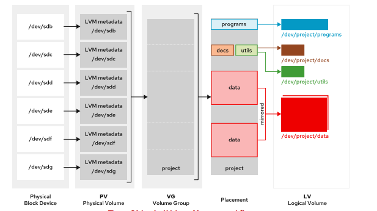
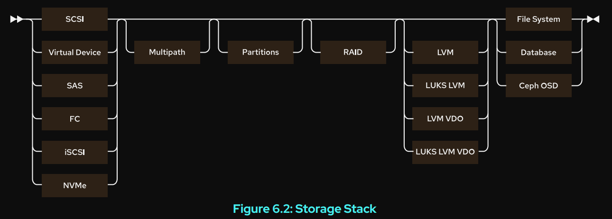
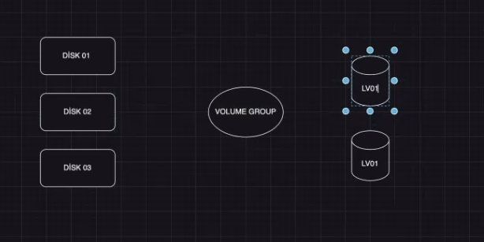
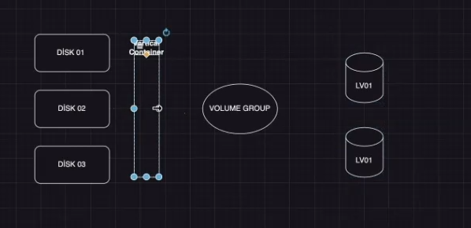

# Create and Extend Logical Volumes

## Logical Volume Manager Overview

fiziksel device

```sh
[root@rocky1 ~]# lsblk
NAME        MAJ:MIN RM  SIZE RO TYPE MOUNTPOINTS
sr0          11:0    1  1.6G  0 rom
nvme0n1     259:0    0   20G  0 disk
├─nvme0n1p1 259:1    0    1G  0 part /boot
└─nvme0n1p2 259:2    0   19G  0 part
  ├─rl-root 253:0    0   17G  0 lvm  /
  └─rl-swap 253:1    0    2G  0 lvm  [SWAP]
nvme0n2     259:3    0    5G  0 disk
nvme0n3     259:4    0    5G  0 disk
nvme0n4     259:5    0    5G  0 disk
nvme0n5     259:6    0    5G  0 disk
```

oluşturabilmek için öncellikle partition atamlarını yapıyoruz.

```sh
[root@rocky1 ~]# parted /dev/nvme0n2 mklabel gpt
Information: You may need to update /etc/fstab.
[root@rocky1 ~]# parted /dev/nvme0n3 mklabel gpt
Information: You may need to update /etc/fstab.
[root@rocky1 ~]# parted /dev/nvme0n4 mklabel gpt
Information: You may need to update /etc/fstab.
[root@rocky1 ~]# parted /dev/nvme0n5 mklabel gpt
Information: You may need to update /etc/fstab.
#tekrar atanırsa
[root@rocky1 ~]# parted /dev/nvme0n5 mklabel gpt
Warning: The existing disk label on /dev/nvme0n5 will be destroyed and all data on this disk will be lost. Do you want to continue?
Yes/No? Yes
Information: You may need to update /etc/fstab.
```

```sh

[root@rocky1 ~]# parted /dev/nvme0n2
GNU Parted 3.5
Using /dev/nvme0n2
Welcome to GNU Parted! Type 'help' to view a list of commands.
(parted) mkpart
Partition name?  []? primary
File system type?  [ext2]? xfs
Start? 0%
End? 100%
(parted) quit
Information: You may need to update /etc/fstab.

[root@rocky1 ~]# parted /dev/nvme0n3
GNU Parted 3.5
Using /dev/nvme0n3
Welcome to GNU Parted! Type 'help' to view a list of commands.
(parted) mkpart
Partition name?  []? primary
File system type?  [ext2]? xfs
Start? 0%
End? 100%
(parted) quit
Information: You may need to update /etc/fstab.

[root@rocky1 ~]# parted /dev/nvme0n4
GNU Parted 3.5
Using /dev/nvme0n4
Welcome to GNU Parted! Type 'help' to view a list of commands.
(parted) mkpart
Partition name?  []? primary
File system type?  [ext2]? xfs
Start? 0%
End? 100%
(parted) q
Information: You may need to update /etc/fstab.


[root@rocky1 ~]# parted /dev/nvme0n5
GNU Parted 3.5
Using /dev/nvme0n5
Welcome to GNU Parted! Type 'help' to view a list of commands.
(parted) mkpart
Partition name?  []? primary
File system type?  [ext2]? xfs
Start? 0%
End? 100%
(parted) q
Information: You may need to update /etc/fstab.

```

son lsblk çıktısı

```sh
[root@rocky1 ~]# lsblk
NAME        MAJ:MIN RM  SIZE RO TYPE MOUNTPOINTS
sr0          11:0    1  1.6G  0 rom
nvme0n1     259:0    0   20G  0 disk
├─nvme0n1p1 259:1    0    1G  0 part /boot
└─nvme0n1p2 259:2    0   19G  0 part
  ├─rl-root 253:0    0   17G  0 lvm  /
  └─rl-swap 253:1    0    2G  0 lvm  [SWAP]
nvme0n2     259:3    0    5G  0 disk
└─nvme0n2p1 259:7    0    5G  0 part
nvme0n3     259:4    0    5G  0 disk
└─nvme0n3p1 259:8    0    5G  0 part
nvme0n4     259:5    0    5G  0 disk
└─nvme0n4p1 259:9    0    5G  0 part
nvme0n5     259:6    0    5G  0 disk
└─nvme0n5p1 259:10   0    5G  0 part
```


Logical Volume Manager Workflow

• Determine the physical devices used for creating physical volumes, and initialize these devices
as LVM physical volumes.
• Create a volume group from multiple physical volumes.
• Create the logical volumes from the available space in the volume group.
• Format the logical volume with a file system and mount it, or activate it as swap space, or pass
the raw volume to a database or storage server for advanced structures.





## Build LVM Storage


Prepare Physical Devices

Partitioning is optional when already present. Use the parted command to create a new partition
on the physical device. Set the physical device to the Linux LVM partition type. Use the
udevadm settle command to register the new partition with the kernel

```sh
[root@host ~]# parted /dev/vdb mklabel gpt mkpart primary 1MiB 769MiB
...output omitted...
[root@host ~]# parted /dev/vdb mkpart primary 770MiB 1026MiB
[root@host ~]# parted /dev/vdb set 1 lvm on
[root@host ~]# parted /dev/vdb set 2 lvm on
[root@host ~]# udevadm settle
```


```sh
[root@rocky1 ~]# parted /dev/nvme0n2 set 1 lvm on
Information: You may need to update /etc/fstab.

[root@rocky1 ~]# parted /dev/nvme0n3 set 1 lvm on
Information: You may need to update /etc/fstab.

```


Create Physical Volumes

Use the pvcreate command to label the physical partition as an LVM physical volume. Label
multiple devices simultaneously by using space-delimited device names as arguments to the
pvcreate command. This example labels the /dev/vdb1 and /dev/vdb2 devices as PVs that
are ready for creating volume groups


```sh
[root@rocky1 ~]# pvcreate /dev/nvme0n2p1 /dev/nvme0n3p1
  Physical volume "/dev/nvme0n2p1" successfully created.
  Physical volume "/dev/nvme0n3p1" successfully created.
[root@rocky1 ~]# pvdisplay
  --- Physical volume ---
  PV Name               /dev/nvme0n1p2
  VG Name               rl
  PV Size               <19.00 GiB / not usable 3.00 MiB
  Allocatable           yes (but full)
  PE Size               4.00 MiB
  Total PE              4863
  Free PE               0
  Allocated PE          4863
  PV UUID               k33oDM-vyS9-LPLX-VTNM-QKEn-pOe4-9aUOu7

  "/dev/nvme0n2p1" is a new physical volume of "<5.00 GiB"
  --- NEW Physical volume ---
  PV Name               /dev/nvme0n2p1
  VG Name
  PV Size               <5.00 GiB
  Allocatable           NO
  PE Size               0
  Total PE              0
  Free PE               0
  Allocated PE          0
  PV UUID               FVW3Jz-94AC-dfeb-IdEA-tzOR-un0w-6oihxg

  "/dev/nvme0n3p1" is a new physical volume of "<5.00 GiB"
  --- NEW Physical volume ---
  PV Name               /dev/nvme0n3p1
  VG Name
  PV Size               <5.00 GiB
  Allocatable           NO
  PE Size               0
  Total PE              0
  Free PE               0
  Allocated PE          0
  PV UUID               vjOdUJ-zlRK-nG4o-psgH-7avr-Z370-Y4IODK

```


Create a Volume Group

The vgcreate command builds one or more physical volumes into a volume group. The first
argument is a volume group name, followed by one or more physical volumes to allocate to this
VG. This example creates the vg01 VG using the /dev/vdb1 and /dev/vdb2 PVs


```sh
[root@host ~]# vgcreate vg01 /dev/vdb1 /dev/vdb2
 Volume group "vg01" successfully created
```

```sh
[root@rocky1 ~]# vgcreate vol01 /dev/nvme0n2p1 /dev/nvme0n3p1
  Volume group "vol01" successfully created
[root@rocky1 ~]# vgdisplay
  --- Volume group ---
  VG Name               vol01
  System ID
  Format                lvm2
  Metadata Areas        2
  Metadata Sequence No  1
  VG Access             read/write
  VG Status             resizable
  MAX LV                0
  Cur LV                0
  Open LV               0
  Max PV                0
  Cur PV                2
  Act PV                2
  VG Size               9.99 GiB
  PE Size               4.00 MiB
  Total PE              2558
  Alloc PE / Size       0 / 0
  Free  PE / Size       2558 / 9.99 GiB
  VG UUID               M4Fc9j-mos6-Mmnk-tWW3-t7CA-lvuX-96ESOc

  --- Volume group ---
  VG Name               rl
  System ID
  Format                lvm2
  Metadata Areas        1
  Metadata Sequence No  3
  VG Access             read/write
  VG Status             resizable
  MAX LV                0
  Cur LV                2
  Open LV               2
  Max PV                0
  Cur PV                1
  Act PV                1
  VG Size               <19.00 GiB
  PE Size               4.00 MiB
  Total PE              4863
  Alloc PE / Size       4863 / <19.00 GiB
  Free  PE / Size       0 / 0
  VG UUID               LMp8iC-lwW5-kW7Y-8FJd-Mne7-IUGp-bMWNPE

```


Create a Logical Volume

The lvcreate command creates a new logical volume from the available PEs in a volume group.
Use the lvcreate command to set the LV name and size and the VG name that will contain this
logical volume. This example creates lv01 LV with 700 MiB in size in the vg01 VG

```sh
[root@host ~]# lvcreate -n lv01 -L 300M vg01
 Logical volume "lv01" created.
```


```sh
[root@rocky1 ~]# lvcreate -n logicalvol01 -L 5GiB vol01
  Logical volume "logicalvol01" created.
[root@rocky1 ~]# lvdisplay
  --- Logical volume ---
  LV Path                /dev/vol01/logicalvol01
  LV Name                logicalvol01
  VG Name                vol01
  LV UUID                IfloGP-21tT-AG1c-WZ9X-bDSy-hU2f-eS1hjk
  LV Write Access        read/write
  LV Creation host, time rocky1, 2024-08-21 21:13:33 +0300
  LV Status              available
  # open                 0
  LV Size                5.00 GiB
  Current LE             1280
  Segments               2
  Allocation             inherit
  Read ahead sectors     auto
  - currently set to     256
  Block device           253:2

  --- Logical volume ---
  LV Path                /dev/rl/root
  LV Name                root
  VG Name                rl
  LV UUID                y2T2eB-4nD2-Ar0o-Pdcd-0PHq-vjkN-NgnJBb
  LV Write Access        read/write
  LV Creation host, time rocky1, 2024-05-29 17:12:37 +0300
  LV Status              available
  # open                 1
  LV Size                <17.00 GiB
  Current LE             4351
  Segments               1
  Allocation             inherit
  Read ahead sectors     auto
  - currently set to     256
  Block device           253:0

  --- Logical volume ---
  LV Path                /dev/rl/swap
  LV Name                swap
  VG Name                rl
  LV UUID                NfDmZH-2d3W-WdwP-2pR6-xxmN-9TgU-MbJaRP
  LV Write Access        read/write
  LV Creation host, time rocky1, 2024-05-29 17:12:37 +0300
  LV Status              available
  # open                 2
  LV Size                2.00 GiB
  Current LE             512
  Segments               1
  Allocation             inherit
  Read ahead sectors     auto
  - currently set to     256
  Block device           253:1
[root@rocky1 ~]# lvcreate -n logicalvol02 -L 4GiB vol01
  Logical volume "logicalvol02" created.
[root@rocky1 ~]# lvdisplay
  --- Logical volume ---
  LV Path                /dev/vol01/logicalvol01
  LV Name                logicalvol01
  VG Name                vol01
  LV UUID                IfloGP-21tT-AG1c-WZ9X-bDSy-hU2f-eS1hjk
  LV Write Access        read/write
  LV Creation host, time rocky1, 2024-08-21 21:13:33 +0300
  LV Status              available
  # open                 0
  LV Size                5.00 GiB
  Current LE             1280
  Segments               2
  Allocation             inherit
  Read ahead sectors     auto
  - currently set to     256
  Block device           253:2

  --- Logical volume ---
  LV Path                /dev/vol01/logicalvol02
  LV Name                logicalvol02
  VG Name                vol01
  LV UUID                9hRK7G-Sdg4-crSi-IFhL-eQ5H-T6zO-36JHrJ
  LV Write Access        read/write
  LV Creation host, time rocky1, 2024-08-21 21:18:40 +0300
  LV Status              available
  # open                 0
  LV Size                4.00 GiB
  Current LE             1024
  Segments               1
  Allocation             inherit
  Read ahead sectors     auto
  - currently set to     256
  Block device           253:3

  --- Logical volume ---
  LV Path                /dev/rl/root
  LV Name                root
  VG Name                rl
  LV UUID                y2T2eB-4nD2-Ar0o-Pdcd-0PHq-vjkN-NgnJBb
  LV Write Access        read/write
  LV Creation host, time rocky1, 2024-05-29 17:12:37 +0300
  LV Status              available
  # open                 1
  LV Size                <17.00 GiB
  Current LE             4351
  Segments               1
  Allocation             inherit
  Read ahead sectors     auto
  - currently set to     256
  Block device           253:0

  --- Logical volume ---
  LV Path                /dev/rl/swap
  LV Name                swap
  VG Name                rl
  LV UUID                NfDmZH-2d3W-WdwP-2pR6-xxmN-9TgU-MbJaRP
  LV Write Access        read/write
  LV Creation host, time rocky1, 2024-05-29 17:12:37 +0300
  LV Status              available
  # open                 2
  LV Size                2.00 GiB
  Current LE             512
  Segments               1
  Allocation             inherit
  Read ahead sectors     auto
  - currently set to     256
  Block device           253:1

```


The lvcreate command -L option requires sizes in bytes, mebibytes (binary megabytes,
1048576 bytes), and gibibytes (binary gigabytes), or similar. The lower case -l requires sizes
specified as a number of physical extents. The following commands are two choices for creating
the same LV with the same size

```sh
• lvcreate -n lv01 -L 128M vg01 : create an LV of size 128 MiB, rounded to the next PE.
• lvcreate -n lv01 -l 32 vg01 : create an LV of size 32 PEs at 4 MiB each is 128 MiB.
```


Create a File System on the Logical Volume


```sh
[root@host ~]# mkfs -t xfs /dev/vg01/lv01
...output omitted...


#Create a mount point using the mkdir command.
[root@host ~]# mkdir /mnt/data

#To make the file system available persistently, add an entry to the /etc/fstab file

/dev/vg01/lv01 /mnt/data xfs defaults 0 0

#Mount the LV by using the mount command
[root@host ~]# mount /mnt/data/
```


```sh
[root@rocky1 ~]# mkfs -t xfs /dev/vol01/logicalvol01
meta-data=/dev/vol01/logicalvol01 isize=512    agcount=4, agsize=327680 blks
         =                       sectsz=512   attr=2, projid32bit=1
         =                       crc=1        finobt=1, sparse=1, rmapbt=0
         =                       reflink=1    bigtime=1 inobtcount=1 nrext64=0
data     =                       bsize=4096   blocks=1310720, imaxpct=25
         =                       sunit=0      swidth=0 blks
naming   =version 2              bsize=4096   ascii-ci=0, ftype=1
log      =internal log           bsize=4096   blocks=16384, version=2
         =                       sectsz=512   sunit=0 blks, lazy-count=1
realtime =none                   extsz=4096   blocks=0, rtextents=0


[root@rocky1 ~]# mkfs -t xfs /dev/vol01/logicalvol02
meta-data=/dev/vol01/logicalvol02 isize=512    agcount=4, agsize=262144 blks
         =                       sectsz=512   attr=2, projid32bit=1
         =                       crc=1        finobt=1, sparse=1, rmapbt=0
         =                       reflink=1    bigtime=1 inobtcount=1 nrext64=0
data     =                       bsize=4096   blocks=1048576, imaxpct=25
         =                       sunit=0      swidth=0 blks
naming   =version 2              bsize=4096   ascii-ci=0, ftype=1
log      =internal log           bsize=4096   blocks=16384, version=2
         =                       sectsz=512   sunit=0 blks, lazy-count=1
realtime =none                   extsz=4096   blocks=0, rtextents=0

[root@rocky1 ~]# mount /dev/vol01/logicalvol02 /mnt/lvm

[root@rocky1 ~]# lsblk
NAME                   MAJ:MIN RM  SIZE RO TYPE MOUNTPOINTS
sr0                     11:0    1  1.6G  0 rom
nvme0n1                259:0    0   20G  0 disk
├─nvme0n1p1            259:1    0    1G  0 part /boot
└─nvme0n1p2            259:2    0   19G  0 part
  ├─rl-root            253:0    0   17G  0 lvm  /
  └─rl-swap            253:1    0    2G  0 lvm  [SWAP]
nvme0n2                259:3    0    5G  0 disk
└─nvme0n2p1            259:7    0    5G  0 part
  └─vol01-logicalvol01 253:2    0    5G  0 lvm
nvme0n3                259:4    0    5G  0 disk
└─nvme0n3p1            259:8    0    5G  0 part
  ├─vol01-logicalvol01 253:2    0    5G  0 lvm
  └─vol01-logicalvol02 253:3    0    4G  0 lvm  /mnt/lvm
nvme0n4                259:5    0    5G  0 disk
└─nvme0n4p1            259:9    0    5G  0 part
nvme0n5                259:6    0    5G  0 disk
└─nvme0n5p1            259:10   0    5G  0 part


```


Create a Logical Volume with Deduplication and Compression


## Display LVM Component Status

LVM provides various utilities to display the status information of PV, VG, and LV. Use the
pvdisplay, vgdisplay, and lvdisplay commands to show the status information of the LVM
components

The associated pvs, vgs, and lvs commands are commonly used and show a subset of the status
information, with one line for each entity

Display Physical Volume Information

The pvdisplay command displays information about the PVs. Use the command without
arguments to list information of all PVs present on the system. Providing the name of the PV as
the argument to the command shows the information specific to the PV

```sh
[root@host ~]# pvdisplay /dev/vdb1
 --- Physical volume ---
 #PV Name shows the device name.
 PV Name /dev/vdb1 
 #VG Name shows the volume group where the PV is allocated.
 VG Name vg01 
 #PV Size shows the physical size of the PV, including unusable space.
 PV Size 731.98 MiB / not usable 3.98 MiB 
 Allocatable yes
 #PE Size shows the physical extent size
 PE Size 4.00 MiB 
 Total PE 182
 #Free PE shows the PE size available in the VG to create new LVs or extend existing LVs.
 Free PE 107 
 Allocated PE 75
 PV UUID zP0gD9-NxTV-Qtoi-yfQD-TGpL-0Yj0-wExh2N
```


Display Volume Group Information

The vgdisplay command shows the information about volume groups. To list information about
all VGs, use the command without arguments. Provide the name of the VG as an argument to list
information specific to the VG.

```sh
[root@host ~]# vgdisplay vg01
 --- Volume group ---
 #VG Name shows the name of the volume group.
 VG Name vg01 
 System ID
 Format lvm2
 Metadata Areas 2
 Metadata Sequence No 2
 VG Access read/write
 VG Status resizable
 MAX LV 0
 Cur LV 1
 Open LV 1
 Max PV 0
 Cur PV 2
 Act PV 2
 #VG Size displays the total size of the storage pool available for LV allocation.
 VG Size 1012.00 MiB 
 #Total PE shows the total size of PE units.
 PE Size 4.00 MiB
 Total PE 253 
 Alloc PE / Size 75 / 300.00 MiB
 #Free PE / Size shows the available space in the VG to create new LVs or extend existing LVs.
 Free PE / Size 178 / 712.00 MiB 
 VG UUID jK5M1M-Yvlk-kxU2-bxmS-dNjQ-Bs3L-DRlJNc

```

Display Logical Volume Information


The lvdisplay command displays information about logical volumes. Use the command without
arguments to list information of all LVs. Providing the name of the LV as an argument displays the
information specific to the LV.

```sh
[root@host ~]# lvdisplay /dev/vg01/lv01
 --- Logical volume ---
 #LV Path shows the device name of the LV
 LV Path /dev/vg01/lv01 
 LV Name lv01
 #VG Name shows the VG used for creating this LV.
 VG Name vg01 
 LV UUID FVmNel-u25R-dt3p-C5L6-VP2w-QRNP-scqrbq
 LV Write Access read/write
 LV Creation host, time servera.lab.example.com, 2022-04-07 10:45:34 -0400
 LV Status available
 # open 1
 #LV Size shows the total size of the LV. Use the file-system tools to determine the free and used space for the LV.
 LV Size 300.00 MiB 
 #LV Size shows the total size of the LV. Use the file-system tools to determine the free and used space for the LV.
 Current LE 75 
 Segments 1
 Allocation inherit
 Read ahead sectors auto
 - currently set to 8192
 Block device 253:0
```


## Extend and Reduce LVM Storage


After creating a logical volume, you can extend the volume to expand the file system. You may
require extending PV or VG to increase the storage capacity of the LV.


Extend a Volume Group Size

You might need to add more disk space to extend a VG. You can add additional physical volumes
to a VG to extend its available size.

Prepare the physical device and create the physical volume when not present.


```sh
[root@host ~]# parted /dev/vdb mkpart primary 1072MiB 1648MiB
...output omitted...
[root@host ~]# parted /dev/vdb set 3 lvm on
...output omitted...
[root@host ~]# udevadm settle
[root@host ~]# pvcreate /dev/vdb3
 Physical volume "/dev/vdb3" successfully created.
```

The vgextend command adds the new PV to the VG. Provide the VG and PV names as
arguments to the vgextend command.


```sh
[root@host ~]# vgextend vg01 /dev/vdb3
 Volume group "vg01" successfully extended
```


Extend a Logical Volume Size

A benefit of using logical volumes is increasing their size without experiencing any downtime. Add
free physical extents to the LV in the VG to extend its capacity to expand the LV's file system. Use
the vgdisplay command to confirm that the volume group has sufficient free space for the LV
extension.


Use the lvextend command to extend the LV

```sh
[root@host ~]# lvextend -L +500M /dev/vg01/lv01
 Size of logical volume vg01/lv01 changed from 300.00 MiB (75 extents) to 800.00
 MiB (200 extents).
 Logical volume vg01/lv01 successfully resized.

```

This command increases the size of the lv01 logical volume by 500 MiB. The (+) plus sign in front
of the size means you want to add this value to the existing size; otherwise, without the plus sign,
the value defines the final size of the LV.


The lvextend command uses different methods to specify the size. The lvextend command -l
option expects the number of PE as the argument. The lvextend command -L option expects
sizes in bytes, mebibytes, gibibytes, and similar.


Extend an XFS File System to the Logical Volume Size

The xfs_growfs command helps expand the file system to occupy the extended LV. The target
file system must be mounted before you use the xfs_growfs command. You can continue to use
the file system while resizing.

```sh
[root@host ~]# xfs_growfs /mnt/data/
...output omitted...
data blocks changed from 76800 to 204800
```


Extend an EXT4 File System to the Logical Volume Size

The steps for extending LV using the ext4 file system are the same for LV using the XFS file
system, except for the step to resize the file system.

The resize2fs command expands the file system to occupy the new extended LV. You can
continue to use the file system while resizing.

```sh
[root@host ~]# resize2fs /dev/vg01/lv01
resize2fs 1.46.5 (30-Dec-2021)
Resizing the filesystem on /dev/vg01/lv01 to 256000 (4k) blocks.
The filesystem on /dev/vg01/lv01 is now 256000 (4k) blocks long.
```

The primary difference between xfs_growfs and resize2fs is the argument passed to identify
the file system. The xfs_growfs command takes the mount point as an argument, and the
resize2fs command takes the LV name as an argument. The xfs_growfs command only
supports an online resize whereas the resize2fs command supports both online and offline
resizing. You can resize an ext4 file system up or down, but you can only resize an XFS file system
up.


Extend Swap Space Logical Volumes


You can extend the LVs used as swap space; however, the process differs from expanding the
ext4 or XFS file system. Logical volumes used as swap space must be offline to extend them.

Use the swapoff command to deactivate the swap space on the LV.


```sh
[root@host ~]# swapoff -v /dev/vg01/swap
swapoff /dev/vg01/swap
```

Use the lvextend command to extend the LV.

```sh
[root@host ~]# lvextend -L +300M /dev/vg01/swap
 Size of logical volume vg01/swap changed from 500.00 MiB (125 extents) to 800.00
 MiB (200 extents).
 Logical volume vg01/swap successfully resized.

```

Use the mkswap command to format the LV as swap space.


```sh
[root@host ~]# mkswap /dev/vg01/swap
mkswap: /dev/vg01/swap: warning: wiping old swap signature.
Setting up swapspace version 1, size = 800 MiB (838856704 bytes)
no label, UUID=25b4d602-6180-4b1c-974e-7f40634ad660

```

Use the swapon command to activate the swap space on the LV

```sh
[root@host ~]# swapon /dev/vg01/swap
```


Reduce Volume Group Storage

LVM kullanılıyor yapılandırma yapılmış durumda fiziksel 

-diskin kaldırılması veya lvm yapısının yeniden boyutlandırılması isteniyor

-diskin çıkartılarak veri kurtarma için yapılabilir

Bu işlem için birden fazla disk lazımdır. Birden fazla diskin kullanılması da önerilir.

Reducing a VG involves removing unused PV from the VG. The pvmove command moves data
from extents on one PV to extents on another PV with enough free extents in the same VG. You
may continue to use the LV from the same VG while reducing. Use the pvmove command -A
option to automatically backup the metadata of the VG after a change. This option uses the
vgcfgbackup command to backup metadata automatically.


çalışan bir disk taşınmaz başka bir diske taşınması gerekir.

```sh
[root@host ~]# pvmove /dev/vdb3
```

Use the vgreduce command to remove a PV from a VG.


```sh
[root@host ~]# vgreduce vg01 /dev/vdb3
 Removed "/dev/vdb3" from volume group "vg01"
```

The GFS2 and XFS file systems do not support shrinking, so you cannot reduce the
size of an LV.


## Remove LVM Storage


Use the lvremove, vgremove, and pvremove commands to remove an LVM component that is
no longer required.


Prepare the File System

Move all data that must be kept to another file system. Use the umount command to unmount the
file system and then remove any /etc/fstab entries associated with this file system.


```sh
[root@host ~]# umount /mnt/data
```


Remove the Logical Volume

Use the lvremove DEVICE-NAME command to remove a logical volume that is no longer
needed. Unmount the LV file system before running this command. The command prompts for
confirmation before removing the LV.


```sh
[root@host ~]# lvremove /dev/vg01/lv01
Do you really want to remove active logical volume vg01/lv01? [y/n]: y
 Logical volume "lv01" successfully removed.

```

Remove the Volume Group


Use the vgremove VG-NAME command to remove a volume group that is no longer needed.

```sh
[root@host ~]# vgremove vg01
 Volume group "vg01" successfully removed
```

The VG's physical volumes are freed and made available for assignment to existing or new VGs on
the system.

Remove the Physical Volumes

Use the pvremove command to remove physical volumes that are no longer needed. Use a
space-delimited list of PV devices to remove more than one at a time. This command deletes the
PV metadata from the partition (or disk). The partition is now free for reallocation or reformatting.

```sh
[root@host ~]# pvremove /dev/vdb1 /dev/vdb2
 Labels on physical volume "/dev/vdb1" successfully wiped.
 Labels on physical volume "/dev/vdb2" successfully wiped.

```


Parted ile partition yaratıyoruz.

```sh
[root@host ~]# pvcreate /dev/vdb1 /dev/sdb1
[root@host ~]# vgcreate vg01 /dev/vdb1
[root@host ~]# lvcreate -l 100%FREE -n lv01 vg01
[root@host ~]# lvextend -r -L +100G /dev/ubuntu-vg/ubuntu-lv
[root@host ~]# lvextend -l +100%FREE /dev/hanadata/LV_hanadata
```


https://networklessons.com/uncategorized/extend-lvm-partition


LAB 177 --> 182


# Manage Layered Storage


## Storage Stack

Storage in RHEL is comprised of multiple layers of drivers, managers, and utilities that are mature,
stable, and full of modern features. Managing storage requires familiarity with stack components,
and recognizing that storage configuration affects the boot process, application performance, and
the ability to provide needed storage features for specific application use cases.





Block Device


Multipath


mantık olarak fiziksel katman, volume katmanı, volume group katmanı





Volume Container katmanı




```sh
[root@rocky2 ~]# lsblk
NAME        MAJ:MIN RM  SIZE RO TYPE MOUNTPOINTS
sr0          11:0    1 1024M  0 rom
nvme0n1     259:0    0   20G  0 disk
├─nvme0n1p1 259:1    0    1G  0 part /boot
└─nvme0n1p2 259:2    0   19G  0 part
  ├─rl-root 253:0    0   17G  0 lvm  /
  └─rl-swap 253:1    0    2G  0 lvm  [SWAP]
nvme0n2     259:3    0    5G  0 disk
nvme0n3     259:4    0    5G  0 disk
nvme0n4     259:5    0    5G  0 disk
nvme0n5     259:6    0    5G  0 disk

[root@rocky2 ~]# parted /dev/nvme0n2 mklabel gpt mkpart primary 0% 100%
Information: You may need to update /etc/fstab.

[root@rocky2 ~]# parted /dev/nvme0n3 mklabel gpt mkpart primary 0% 100%
Information: You may need to update /etc/fstab.

[root@rocky2 ~]# parted /dev/nvme0n4 mklabel gpt mkpart primary 0% 100%
Information: You may need to update /etc/fstab.

[root@rocky2 ~]# lsblk
NAME        MAJ:MIN RM  SIZE RO TYPE MOUNTPOINTS
sr0          11:0    1 1024M  0 rom
nvme0n1     259:0    0   20G  0 disk
├─nvme0n1p1 259:1    0    1G  0 part /boot
└─nvme0n1p2 259:2    0   19G  0 part
  ├─rl-root 253:0    0   17G  0 lvm  /
  └─rl-swap 253:1    0    2G  0 lvm  [SWAP]
nvme0n2     259:3    0    5G  0 disk
└─nvme0n2p1 259:7    0    5G  0 part
nvme0n3     259:4    0    5G  0 disk
└─nvme0n3p1 259:8    0    5G  0 part
nvme0n4     259:5    0    5G  0 disk
└─nvme0n4p1 259:9    0    5G  0 part
nvme0n5     259:6    0    5G  0 disk


[root@rocky2 ~]# pvcreate /dev/nvme0n2p1
  Physical volume "/dev/nvme0n2p1" successfully created.
[root@rocky2 ~]# pvcreate /dev/nvme0n3p1
  Physical volume "/dev/nvme0n3p1" successfully created.
[root@rocky2 ~]# pvcreate /dev/nvme0n4p1
  Physical volume "/dev/nvme0n4p1" successfully created.

[root@rocky2 ~]# vgcreate vg01 /dev/nvme0n2p1 /dev/nvme0n3p1 /dev/nvme0n4p1 
  Volume group "vg01" successfully created
[root@rocky2 ~]# vgdisplay
  --- Volume group ---
  VG Name               vg01
  System ID
  Format                lvm2
  Metadata Areas        3
  Metadata Sequence No  1
  VG Access             read/write
  VG Status             resizable
  MAX LV                0
  Cur LV                0
  Open LV               0
  Max PV                0
  Cur PV                3
  Act PV                3
  VG Size               <14.99 GiB
  PE Size               4.00 MiB
  Total PE              3837
  Alloc PE / Size       0 / 0
  Free  PE / Size       3837 / <14.99 GiB
  VG UUID               dlSoe9-fikk-oBEW-3Ybc-61rp-TmBM-dmAc3P

  --- Volume group ---
  VG Name               rl
  System ID
  Format                lvm2
  Metadata Areas        1
  Metadata Sequence No  3
  VG Access             read/write
  VG Status             resizable
  MAX LV                0
  Cur LV                2
  Open LV               2
  Max PV                0
  Cur PV                1
  Act PV                1
  VG Size               <19.00 GiB
  PE Size               4.00 MiB
  Total PE              4863
  Alloc PE / Size       4863 / <19.00 GiB
  Free  PE / Size       0 / 0
  VG UUID               LMp8iC-lwW5-kW7Y-8FJd-Mne7-IUGp-bMWNPE


[root@rocky2 ~]# lvcreate -n lv01 -l +100%FREE vg01
  Logical volume "lv01" created.
[root@rocky2 ~]# lvdisplay
  --- Logical volume ---
  LV Path                /dev/vg01/lv01
  LV Name                lv01
  VG Name                vg01
  LV UUID                ZX0f3L-y7ep-ZPZp-Uqze-yYpA-RjoQ-5gQfr5
  LV Write Access        read/write
  LV Creation host, time rocky2, 2024-08-22 20:56:46 +0300
  LV Status              available
  # open                 0
  LV Size                <14.99 GiB
  Current LE             3837
  Segments               3
  Allocation             inherit
  Read ahead sectors     auto
  - currently set to     8192
  Block device           253:2

  --- Logical volume ---
  LV Path                /dev/rl/root
  LV Name                root
  VG Name                rl
  LV UUID                y2T2eB-4nD2-Ar0o-Pdcd-0PHq-vjkN-NgnJBb
  LV Write Access        read/write
  LV Creation host, time rocky1, 2024-05-29 17:12:37 +0300
  LV Status              available
  # open                 1
  LV Size                <17.00 GiB
  Current LE             4351
  Segments               1
  Allocation             inherit
  Read ahead sectors     auto
  - currently set to     8192
  Block device           253:0

  --- Logical volume ---
  LV Path                /dev/rl/swap
  LV Name                swap
  VG Name                rl
  LV UUID                NfDmZH-2d3W-WdwP-2pR6-xxmN-9TgU-MbJaRP
  LV Write Access        read/write
  LV Creation host, time rocky1, 2024-05-29 17:12:37 +0300
  LV Status              available
  # open                 2
  LV Size                2.00 GiB
  Current LE             512
  Segments               1
  Allocation             inherit
  Read ahead sectors     auto
  - currently set to     8192
  Block device           253:1


[root@rocky2 ~]# lsblk
NAME          MAJ:MIN RM  SIZE RO TYPE MOUNTPOINTS
sr0            11:0    1 1024M  0 rom
nvme0n1       259:0    0   20G  0 disk
├─nvme0n1p1   259:1    0    1G  0 part /boot
└─nvme0n1p2   259:2    0   19G  0 part
  ├─rl-root   253:0    0   17G  0 lvm  /
  └─rl-swap   253:1    0    2G  0 lvm  [SWAP]
nvme0n2       259:3    0    5G  0 disk
└─nvme0n2p1   259:7    0    5G  0 part
  └─vg01-lv01 253:2    0   15G  0 lvm
nvme0n3       259:4    0    5G  0 disk
└─nvme0n3p1   259:8    0    5G  0 part
  └─vg01-lv01 253:2    0   15G  0 lvm
nvme0n4       259:5    0    5G  0 disk
└─nvme0n4p1   259:9    0    5G  0 part
  └─vg01-lv01 253:2    0   15G  0 lvm
nvme0n5       259:6    0    5G  0 disk


[root@rocky2 ~]# cd /dev/vg01/
[root@rocky2 vg01]# ls
lv01


```


